# report
# FreshSense

<div align="center">

<h3>Universidad Peruana de Ciencias Aplicadas</h3>

<br>

<strong>Ingeniería de Software - 2025-2</strong><br>
<strong>1ASI0729 - Desarrollo de Aplicaciones Open Source</strong><br>
<strong>NRC: 7357<br>
<strong>Profesor: Rafael Oswaldo Castro Veramendi</strong><br>

<br><strong>Informe del Trabajo Final</strong><br><br>

<strong>Startup: SenseEat</strong><br>
<strong>Producto: FreshSense</strong><br>


### Team Members:

|Member |   Code    |
|:-------------------------------:|:---------:|
|  Valverde Portuguez Natalia Ximena  | u20231a816 |
|  Tumi Oliden Manuel Ignacio  |    u20241c134    |
|  Vega Coronado Fabricio Samir  |    u202317000    |
|  Villanueva Andrade Ysaac Ligorio   |    u20231c168    |
|  Tuesta Marin Romina Alejandra  |    U202211706   |

<strong> Setiembre 2025</strong><br>
</div>

# Registro de Versiones del Informe

| Versión | Fecha      | Autor        | Descripción de modificación|
|---------|------------|--------------|-----------------------------------------------|
| 1.0     | 05/09/2025 | Romina Tuesta | Creación de la estructura inicial del reporte |
|         |  | |         |
|         |  | |         |
|         |  | |         |
|         |  | |         |
|         |  | |         |

# Project Report Collaboration Insights

---

## Contenido
- [Student Outcome](#student-outcome)
- [Capítulo I: Introducción](#capítulo-i-introducción)
    - [1.1. Startup Profile](#11-startup-profile)
        - [1.1.1. Descripción de la Startup](#111-descripción-de-la-startup)
        - [1.1.2. Perfiles de integrantes del equipo](#112-perfiles-de-integrantes-del-equipo)
    - [1.2. Solution Profile](#12-solution-profile)
        - [1.2.1. Antecedentes y problemática](#121-antecedentes-y-problemática)
        - [1.2.2. Lean UX Process](#122-lean-ux-process)
  - [1.2.2.1. Lean UX Problem Statements](#1221-lean-ux-problem-statements)
  - [1.2.2.2. Lean UX Assumptions](#1222-lean-ux-assumptions)
  - [1.2.2.3. Lean UX Hypothesis Statements](#1223-lean-ux-hypothesis-statements)
  - [1.2.2.4. Lean UX Canvas](#1224-lean-ux-canvas)
    - [1.3. Segmentos objetivo](#13-segmentos-objetivo)
- [Capítulo II: Requirements Elicitation & Analysis](#capítulo-ii-requirements-elicitation--analysis)
    - [2.1. Competidores](#21-competidores)
        - [2.1.1. Análisis competitivo](#211-análisis-competitivo)
        - [2.1.2. Estrategias y tácticas frente a competidores](#212-estrategias-y-tácticas-frente-a-competidores)
    - [2.2. Entrevistas](#22-entrevistas)
        - [2.2.1. Diseño de entrevistas](#221-diseño-de-entrevistas)
        - [2.2.2. Registro de entrevistas](#222-registro-de-entrevistas)
        - [2.2.3. Análisis de entrevistas](#223-análisis-de-entrevistas)
    - [2.3. Needfinding](#23-needfinding)
        - [2.3.1. User Personas](#231-user-personas)
        - [2.3.2. User Task Matrix](#232-user-task-matrix)
        - [2.3.3. User Journey Mapping](#233-user-journey-mapping)
        - [2.3.4. Empathy Mapping](#234-empathy-mapping)
        - [2.3.5. As-is Scenario Mapping](#235-as-is-scenario-mapping)
        - 2.4. Big Picture EventStorming
    - [2.4. Ubiquitous Language](#24-ubiquitous-language)
- [Capítulo III: Requirements Specification](#capítulo-iii-requirements-specification)
    - [3.1. To-Be Scenario Mapping](#31-to-be-scenario-mapping)
    - [3.2. User Stories](#32-user-stories)
    - [3.3. Impact Mapping](#33-impact-mapping)
    - [3.4. Product Backlog](#34-product-backlog)
- [Capítulo IV: Product Design](#capítulo-iv-product-design)
    - [4.1. Style Guidelines](#41-style-guidelines)
        - [4.1.1. General Style Guidelines](#411-general-style-guidelines)
        - [4.1.2. Web Style Guidelines](#412-web-style-guidelines)
    - [4.2. Information Architecture](#42-information-architecture)
        - [4.2.1. Organization Systems](#421-organization-systems)
        - [4.2.2. Labeling Systems](#422-labeling-systems)
        - [4.2.3. SEO Tags and Meta Tags](#423-seo-tags-and-meta-tags)
        - [4.2.4. Searching Systems](#424-searching-systems)
        - [4.2.5. Navigation Systems](#425-navigation-systems)
    - [4.3. Landing Page UI Design](#43-landing-page-ui-design)
        - [4.3.1. Landing Page Wireframe](#431-landing-page-wireframe)
        - [4.3.2. Landing Page Mock-up](#432-landing-page-mock-up)
    - [4.4. Web Applications UX/UI Design](#44-web-applications-uxui-design)
        - [4.4.1. Web Applications Wireframes](#441-web-applications-wireframes)
        - [4.4.2. Web Applications Wireflow Diagrams](#442-web-applications-wireflow-diagrams)
        - [4.4.2. Web Applications Mock-ups](#442-web-applications-mock-ups)
        - [4.4.3. Web Applications User Flow Diagrams](#443-web-applications-user-flow-diagrams)
    - [4.5. Web Applications Prototyping](#45-web-applications-prototyping)
    - [4.6. Domain-Driven Software Architecture](#46-domain-driven-software-architecture)
        - [4.6.1. Software Architecture Context Diagram](#461-software-architecture-context-diagram)
        - [4.6.2. Software Architecture Container Diagrams](#462-software-architecture-container-diagrams)
        - [4.6.3. Software Architecture Components Diagrams](#463-software-architecture-components-diagrams)
    - [4.7. Software Object-Oriented Design](#47-software-object-oriented-design)
        - [4.7.1. Class Diagrams](#471-class-diagrams)
        - [4.7.2. Class Dictionary](#472-class-dictionary)
    - [4.8. Database Design](#48-database-design)
        - [4.8.1. Database Diagram](#481-database-diagram)
- [Capítulo V: Product Implementation, Validation & Deployment](#capítulo-v-product-implementation-validation--deployment)
    - [5.1. Software Configuration Management](#51-software-configuration-management)
        - [5.1.1. Software Development Environment Configuration](#511-software-development-environment-configuration)
        - [5.1.2. Source Code Management](#512-source-code-management)
        - [5.1.3. Source Code Style Guide & Conventions](#513-source-code-style-guide--conventions)
        - [5.1.4. Software Deployment Configuration](#514-software-deployment-configuration)
    - [5.2. Landing Page, Services & Applications Implementation](#52-landing-page-services--applications-implementation)
        - [5.2.1. Sprint 1](#521-sprint-1)
  - [5.2.1.1. Sprint Planning 1](#5211-sprint-planning-1)
  - [5.2.1.2. Aspect Leaders and Collaborators](#5212-aspect-leaders-and-collaborators)
  - [5.2.1.3. Sprint Backlog 1](#5213-sprint-backlog-1)
  - [5.2.1.4. Development Evidence for Sprint Review](#5214-development-evidence-for-sprint-review)
  - [5.2.1.5. Execution Evidence for Sprint Review](#5215-execution-evidence-for-sprint-review)
  - [5.2.1.6. Services Documentation Evidence for Sprint Review](#5216-services-documentation-evidence-for-sprint-review)
  - [5.2.1.7. Software Deployment Evidence for Sprint Review](#5217-software-deployment-evidence-for-sprint-review)
  - [5.2.1.8. Team Collaboration Insights during Sprint](#5218-team-collaboration-insights-during-sprint)

---

## Student Outcome

El curso contribuye al cumplimiento del Student Outcome ABET:

**ABET – EAC - Student Outcome 5**
**Criterio:** *Capacidad de comunicarse efectivamente con un rango de audiencias.*

En el siguiente cuadro se describe las acciones realizadas y enunciados de
conclusiones por parte del grupo, que permiten sustentar el haber alcanzado el logro
del ABET – EAC - Student Outcome 3.

| Criterio específico   | Acciones realizadas | Conclusiones |
|--------------------------------------------------------------------------------------------------|---------------------|--------------|
| Comunica oralmente con efectividad a diferentes rangos de audiencia.  |  | |
| Comunica por escrito con efectividad a diferentes rangos de audiencia |  | |


# Capítulo I: Introducción
## 1.1. Startup Profile
### 1.1.1. Descripción de la Startup

Sense Eat es una startup enfocada en el desarrollo de soluciones tecnológicas para reducir el desperdicio de alimentos en los hogares. A través de la innovación, busca generar un impacto positivo en el cuidado del medio ambiente y la economía familiar, facilitando un mejor control y gestión del inventario alimenticio.

Nuestro producto principal, FreshSense, consiste en un dispositivo equipado con sensores que se coloca dentro del refrigerador para medir la temperatura, humedad y la concentración de gas etileno (indicador clave en el proceso de maduración y descomposición de frutas y verduras). Esta información es enviada a una aplicación web donde los usuarios pueden visualizar el estado de sus alimentos y recibir alertas anticipadas sobre su posible deterioro.

El modelo del negocio de Sense Eat está basado en la venta directa del dispositivo sensor y una suscripción mensual que ofrece funciones premium, como análisis detallado del inventario alimenticio y sugerencias de recetas personalizadas basadas en los productos disponibles, promoviendo así un consumo más eficiente y reducción de desperdicios.
    
### 1.1.2. Perfiles de integrantes del equipo
    

|Miembro| Descripción |
|:---------------------------------------------------------------:|:-------------------------------------------------------------------------------------------------------------------------------------------------------------------------------------------------------------------------------------------------------------------------------------------------------------------------------------------------------------------------------:|
|  | Romina Tuesta Marin - u202211706  <br> Mi nombre es Romina, tengo 20 años y estudio ingeniería de software. Me considero una persona responsable, honesta y dispuesta a ayudar a quien lo necesite cuando trabajamos en grupo, tengo conocimiento en lenguajes de programación como Python, C++, etc. También manejo HTML, CSS y JavaScript y siempre intento aprender algo nuevo de forma autodidacta. |
| Natalia Ximena Valverde Portuguez            | Estudiante de Ingeniería de Software en la Universidad Peruana de Ciencias Aplicadas (UPC). Cuento con conocimientos de Marketing y estoy interesada en el UX Design y base de datos con sql. Experiencia en trabajos de creación de startups en el ámbito laboral, lo que fortalece mis capacidades tanto en trabajos grupales e individuales para las bases de un proyecto.   |   
|         | | 
| Fabricio Samir Vega Coronado        | Actualmente tengo 19 años y curso el cuarto ciclo de Ingeniería de Software. Manejo lenguajes de programación como C++, HTML, Python y MySQL, que aplico en la resolución de problemas y desarrollo de proyectos. Me esfuerzo por combinar mis habilidades técnicas con una mentalidad orientada a la innovación, siempre buscando nuevas formas de mejorar y optimizar procesos. Mi objetivo es seguir creciendo en este campo, aportando soluciones que no solo sean funcionales, sino también creativas y bien fundamentadas.| 
|         | | 
| | Soy Villanueva Andrade Ysaac Ligorio, tengo 20 años y actualmente curso el sexto ciclo de Ingeniería de Software. He adquirido experiencia en diversos lenguajes y tecnologías como C++, Python, Java, C#, HTML y MySQL, además del uso de servicios en la nube mediante Azure. Estas competencias me han permitido desarrollar proyectos académicos y personales donde aplico la programación para resolver problemas de manera eficiente. Mi enfoque combina la parte técnica con una mentalidad creativa e innovadora, buscando siempre optimizar procesos y proponer soluciones escalables. Aspiro a seguir fortaleciendo mi perfil profesional, aportando iniciativas que destaquen tanto por su solidez técnica como por su valor diferencia.| 
|         | |
| | Soy Tumi Oliden Manuel Ignacio, tengo 26 años y curso el sexto ciclo de Ingeniería de Software. A lo largo de mi formación he trabajado con distintos lenguajes como C++, Java, C#, HTML y MySQL, que utilizo para el desarrollo de proyectos académicos y personales. Me considero una persona innovadora, con interés en proponer nuevas ideas y en mantener una comunicación constante con mi equipo para alcanzar objetivos comunes. Mi meta es seguir fortaleciendo mis capacidades y aportar soluciones que destaquen por ser prácticas, creativas y bien estructuradas.| 


## 1.2. Solution Profile

### 1.2.1. Antecedentes y problemática

#### Las 5W's y 2H's

#### What? (¿Qué?)
El desperdicio de alimentos en hogares consiste en la pérdida o desecho de productos alimenticios que podrían ser consumidos, debido a su descomposición, mala gestión o desconocimiento del estado real.

#### Why? (¿Por qué?)
La falta de información precisa y oportuna sobre las condiciones reales dentro del refrigerador (temperatura, humedad, gas etileno) hace que los usuarios no puedan anticipar la descomposición de alimentos, resultando en desperdicio y pérdidas económicas.

#### Where? (¿Dónde?)
En la mayoría de los hogares, principalmente dentro de refrigeradores donde se almacenan frutas, verduras y otros productos perecederos.

#### When? (¿Dónde?)
El desperdicio ocurre frecuentemente cuando los alimentos permanecen almacenados por tiempos prolongados sin monitoreo adecuado, intensificándose en días o semanas, según el tipo de alimento.

#### Who? (¿Quién?)
Usuarios domésticos, principalmente familias, adultos jóvenes, y personas preocupadas por la economía y la sostenibilidad ambiental.

#### How? (¿Cómo?)
Por falta de monitoreo tecnológico que detecte condiciones que aceleran la maduración y deterioro, así como por ausencia de alertas personalizadas para consumir a tiempo.

#### How much? (¿Cuánto?)
Se estima que un tercio de los alimentos producidos se desperdician globalmente. En términos económicos, esto representa pérdidas significativas para los hogares, además de impactos ambientales como generación de residuos y emisiones contaminantes.

##### 1.2.2.1. Lean UX Problem Statements

 - Los usuarios desperdician alimentos porque no tienen información precisa ni anticipada sobre la descomposición de la comida almacenada en sus refrigeradores.
 - La falta de una herramienta accesible que monitoree factores críticos como temperatura, humedad y gas etileno conduce a una gestión ineficiente del inventario alimenticio en hogares.
 - Las personas pierden dinero y contribuyen al impacto ambiental negativo debido a estas ineficientes y falta de alertas preventivas.

##### 1.2.2.2. Lean UX Assumptions
#### Business Assumptions
- Se asume que la implementación de FreshSense permitirá reducir significativamente el desperdicio alimentario en hogares, generando ahorro económico para los usuarios.

- Se espera que al ofrecer análisis avanzado de inventario y recetas personalizadas mediante suscripción, se genera un flujo constante de ingresos recurrentes para la startup.

- Se considera que el mercado doméstico está dispuesto a adoptar tecnología accesible para optimizar lagestión de alimentos, siendo un nicho rentable y escalable.

- Se supone que la facilidad de uso e integración del dispositivo con el app fomentará una alta retención y satisfacción del cliente.
#### User Assumptions
- Se asume que los usuarios valoran recibir alertas tempranas sobre el est ado de sus alimentos para evitar pérdidas innecesarias.

- Se espera que los usuarios quieran ahorrar dinero consumiendo alimentos antes de que se descompongan gracias a la información precisa del dispositivo.

- Se considera que los usuarios usarán activamente la app web para monitorear el estado de su refrigerador y aprovecharán las recetas personalizadas para maximizar la utilización de sus ingredientes.

- Se supone que la simplicidad y utilidad de la solución motivarán a los usuarios a recomendar FreshSense a otras personas preocupadas por reducir desperdicios.

##### 1.2.2.3. Lean UX Hypothesis Statements

- Creemos que ofrecer alertas anticipadas basadas en datos de temperatura, humedad y gas etileno ayudará a los usuarios a consumir sus alimentos antes de que se descompongan, reduciendo así el desperdicio de comida en sus hogares. Sabremos que esto es cierto cuando el porcentaje de alimentos reportados como consumidos antes de la fecha de alerta supere el 70% durante el primer mes de uso. 

- Creemos que permitir el acceso a la aplicación web desde múltiples dispositivos (PC, tablet, móvil) facilitará que los usuarios monitoreen el estado de sus alimentos en cualquier momento y lugar, aumentando la interacción con la plataforma. Sabremos que esto es cierto cuando al menos el 50% de los usuarios activos inicien sesión desde dos o más tipos de dispositivos en la primera semana tras la adopción.

- Creemos que agregar funciones premium como análisis detallado de inventario y recetas personalizadas incentivará a los usuarios a suscribirse y usar el sistema con mayor frecuencia. Sabremos que esto es cierto cuando al menos el 30% de los usuarios activos se suscriban al plan premium dentro de los tres primeros meses de uso.

- Creemos que la inclusión de recetas personalizadas basadas en los alimentos disponibles en el refrigerador motivará a los usuarios a aprovechar mejor sus ingredientes y reducir el desperdicio. Sabremos que esto es cierto cuando al menos el 40% de los usuarios utilicen las recetas sugeridas al menos una vez por semana durante el primer mes de uso.

##### 1.2.2.4. Lean UX Canvas
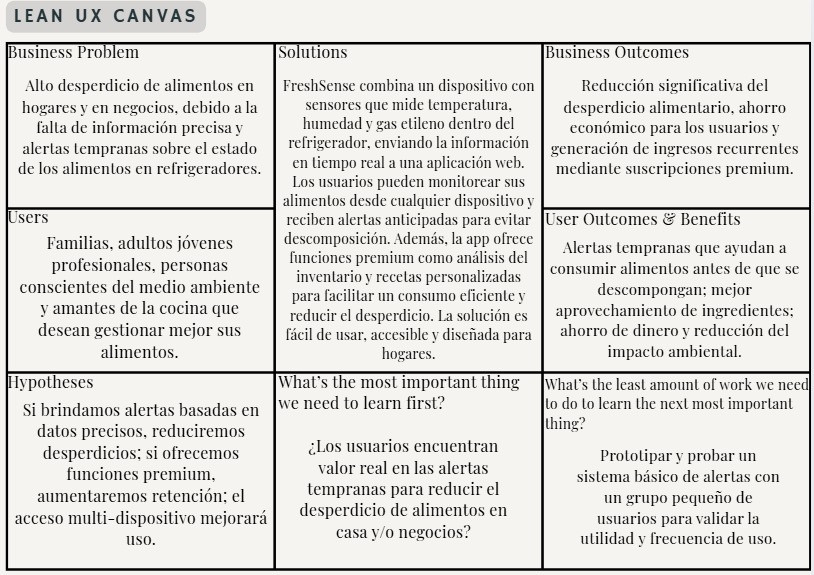

## 1.3. Segmentos objetivo

Para el proyecto FreshSense se han seleccionado dos segmentos principales de usuarios a los cuales la solución aporta un valor claro y adaptado a sus necesidades específicas:

##Adultos jóvenes 
 - Edad: 25 a 40 años
 - Estilo de vida: Dinámico y ocupado.
 - Uso de tecnología: Frecuente.
 - Necesidad principal: Gestionar el inventario alimenticio de forma sencilla y eficiente sin dedicar mucho tiempo.
 - Beneficios buscados: Alertas oportunas y recomendaciones para evitar desperdicios y optimizar el consumo.

##Pequeños negocios o emprendedores de alimentos caseros
 - Perfil: Personas que elaboran y venden alimentos desde casa.
 - Necesidad principal: Controlar la frescura de sus productos para garantizar calidad y minimizar pérdidas.
 - Beneficios buscados: Solución económica y accesible para monitorear productos perecederos y manejar inventario eficientemente.

# Capítulo II: Requirements Elicitation & Analysis
## 2.1. Competidores
Conocer a los competidores es clave para identificar oportunidades y definir una estrategia efectiva para FreshSense. Este análisis considera tanto competidores directos, que ofrecen soluciones similares, como indirectos que abordan el problema del desperdicio alimentario desde otras perspectivas. Comprender sus fortalezas y debilidades permitirá posicionar mejor nuestra propuesta y diferenciarla en el mercado.

### 2.1.1. Análisis competitivo
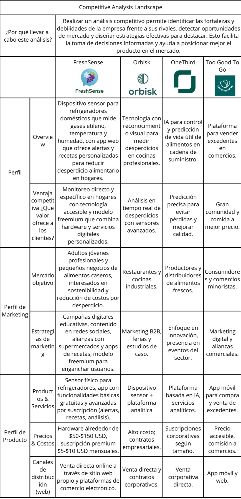
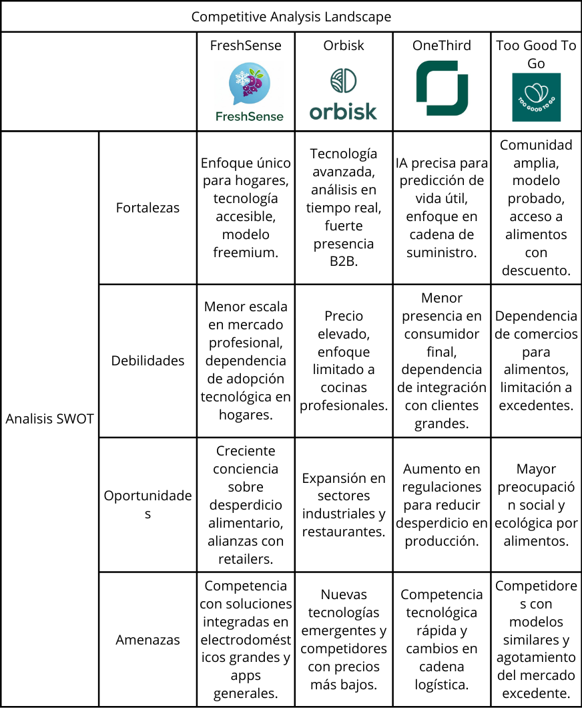

El análisis competitivo realizado permite comprender con claridad el panorama actual del mercado y la posición que ocupa FreshSense frente a competidores relevantes como Orbisk, OneThird y Too Good To Go. Si bien cada actor tiene enfoques y modelos distintos, el valor diferencial de FreshSense radica en su enfoque específico para hogares con una solución tecnológica accesible, combinando hardware y app con un modelo freemium atractivo para el mercado objetivo.

Además, este análisis enfatiza las fortalezas de FreshSense en innovación, precio y marketing educativo, pero también revela áreas de mejora y desafíos potenciales frente a competidores consolidados en segmentos industriales o de consumo masivo. Las oportunidades de crecimiento incluyen el aumento en la conciencia ambiental y las alianzas estratégicas que pueden amplificar su alcance.

En conclusión, FreshSense tiene un posicionamiento sólido pero debe continuar innovando en experiencia de usuario y escalabilidad para consolidarse como líder en la categoría doméstica de control y reducción del desperdicio alimentario.
### 2.1.2. Estrategias y tácticas frente a competidores

FreshSense adoptará una estrategia centrada en diferenciarse por su enfoque específico en hogares, ofreciendo una solución accesible y fácil de usar para el control del desperdicio alimentario en refrigeradores domésticos. Para lograrlo, se aplicarán las siguientes tácticas:

- Campañas de marketing digital y contenidos educativos para sensibilizar sobre el desperdicio alimentario y los beneficios de una gestión eficiente del inventario doméstico.
- Ofrecer un hardware con precio competitivo y acceso gratuito a funciones básicas, incentivando la suscripción a planes premium que agreguen valor con análisis avanzados y recetas personalizadas.
- En redes sociales, producción de contenido útil y atractivo, incluyendo recetas, consejos de conservación y testimonios, que fomenten la comunidad y el engagement.
- Colaboraciones con supermercados, apps de recetas y plataformas de sostenibilidad para ampliar el alcance y la confianza en la marca.
- Desarrollo continuo de la app para maximizar su intuición, usabilidad y valor agregado mediante notificaciones y alertas personalizadas.
- Programas de soporte, encuestas de satisfacción y recompensas para fortalecer la lealtad y generar recomendaciones boca a boca.

Estas estrategias buscan posicionar a FreshSense no solo como un producto tecnológico, sino como un aliado en la reducción del desperdicio de alimentos con impacto positivo en la economía y el medio ambiente de los hogares.

## 2.2. Entrevistas
### 2.2.1. Diseño de entrevistas

## Segmento 1: 
### Adultos jóvenes (25-40 años, dinámicos y ocupados)

#### Hábitos y problemas

1. ¿Qué tan seguido revisas el estado de tus alimentos en el refrigerador?

2. ¿Has tenido que botar comida en la última semana o mes? ¿Qué alimentos suelen desperdiciarse más?

3. ¿Qué sientes cuando tienes que desechar alimentos?

4. ¿Cómo gestionas actualmente tu inventario alimenticio? (listas, memoria, apps, nada).

5. ¿Qué dificultades encuentras al intentar consumir tus alimentos antes de que se malogren?

#### Uso de tecnología

6. ¿Qué aplicaciones o dispositivos usas en tu día a día para organizar tu vida (ejemplo: apps de compras, recordatorios, fitness, etc.)?
   
7. ¿Estarías dispuesto(a) a usar una app para monitorear tus alimentos? ¿Qué esperas que sea fácil o difícil en esa experiencia?

#### Valor y disposición
8. ¿Qué te motivaría a usar un sistema que te avise cuándo un alimento está por vencer o deteriorarse?
   
9. Si además de alertas recibieras recetas personalizadas con lo que tienes en el refrigerador, ¿lo encontrarías útil?
    
10. ¿Pagarías una suscripción mensual por este tipo de servicio? Si sí, ¿qué rango de precio considerarías razonable?


## Segmento 2: 
### Pequeños negocios / emprendedores de alimentos caseros

#### Hábitos y problemas

1. ¿Qué tipo de alimentos manejas en tu negocio y cuáles son más propensos a perderse o malograrse?

2. ¿Con qué frecuencia enfrentas pérdidas por deterioro de productos?

3. ¿Tienes actualmente un método para controlar la frescura de tus ingredientes (listas, hojas de Excel, memoria, otro)?

#### Necesidades

4. ¿Qué impacto tiene para tu negocio perder productos perecibles? (económico, reputación, tiempo, clientes).
5. ¿Qué importancia le das a la calidad y frescura de los alimentos que vendes?
6. ¿Qué tipo de alertas o reportes te gustaría recibir para mejorar tu control de inventario?

#### Valor y disposición
7. ¿Te resultaría útil tener un dispositivo que monitoree automáticamente el estado de los productos dentro de tu refrigerador?
8. ¿Qué características serían imprescindibles para que confíes en este tipo de solución?
9. ¿Pagarías por una herramienta que te ayude a reducir pérdidas y mantener la frescura? ¿Prefieres un pago único por el dispositivo o una suscripción mensual con funciones adicionales?
10. Si el sistema pudiera darte estadísticas de consumo, desperdicio y hasta proyecciones de compras, ¿te serviría para tu negocio?


### 2.2.2. Registro de entrevistas
### Segmento #1: Adultos jóvenes (25-40 años, dinámicos y ocupados)

| Número de entrevista | Datos del entrevistado         | Evidencia de entrevista |
|-----------------------|-----------------------------------------------------------------------------------------|--------------------------|
| 1  | **Nombre:** Piero Tapia  <br> **Edad:** 26  <br> **Distrito:** Jesús María <br><br> **Resumen:** Piero Tapia, trabajador del sector salud, comentó que revisa el refrigerador un par de veces por semana, pero aun así suele botar embutidos y nuggets que no consume a tiempo. Su mayor preocupación es el impacto económico y la incomodidad de desperdiciar comida que otros podrían aprovechar. No utiliza ninguna aplicación ni listas, y reconoce que muchas veces termina comprando lo mismo y aburriéndose de su dieta. Cree que una aplicación le sería útil si cuenta con tutoriales accesibles en cualquier momento, alertas de alimentos por vencer y recetas que le ayuden a variar. Considera justo un costo entre 15 y 25 soles mensuales, similar a una plataforma de streaming, aunque advierte que las notificaciones excesivas podrían volverse molestas |  <br> [📂 Ver entrevista](https://drive.google.com/file/d/15M_YnFO5NuGaYNpKAQJbU-r_Xq8Rc27l/view?usp=drive_link) 0-5:36 |


| Número de entrevista | Datos del entrevistado         | Evidencia de entrevista |
|-----------------------|-----------------------------------------------------------------------------------------|--------------------------|
| 2  | **Nombre:** Alvaro Yagui  <br> **Edad:** 26  <br> **Distrito:** Jesús María <br><br> **Resumen:** Álvaro Yagui, dedicado al área de ventas, señaló que la falta de tiempo y el cansancio hacen que olvide cocinar lo que compra, lo que provoca que carnes, plátanos y paltas se malogren con frecuencia. Asocia estas pérdidas con frustración y descuido, pues implican desperdicio de dinero. No usa aplicaciones para control, salvo alarmas en el celular, pero reconoce que resulta tedioso. Valora la idea de una aplicación que facilite el registro de alimentos mediante voz o escáner, acompañada de notificaciones claras y recetas para combinar los ingredientes disponibles. Está dispuesto a pagar entre 15 y 20 soles mensuales, un rango que equipara al de una suscripción de Spotify |  <br> [📂 Ver entrevista](https://drive.google.com/file/d/15M_YnFO5NuGaYNpKAQJbU-r_Xq8Rc27l/view?usp=drive_link) 5:36-13:41|


| Número de entrevista | Datos del entrevistado         | Evidencia de entrevista |
|-----------------------|-----------------------------------------------------------------------------------------|--------------------------|
| 3  | **Nombre:** Gabriela Vasquez  <br> **Edad:** 25  <br> **Distrito:** Pueblo Libre <br><br> **Resumen:** Gabriela Vázquez, de 25 años, reconoció que suele revisar el refrigerador solo una vez por semana, lo que la lleva a olvidar alimentos y desperdiciar principalmente frutas y verduras. Este hábito le genera frustración y la sensación de estar perdiendo dinero. Aunque utiliza notas y calendario para organizarse, no aplica ninguna herramienta específica para gestionar la comida. Considera valiosa una aplicación siempre que sea intuitiva, atractiva y con recordatorios confiables, además de que le ofrezca recetas para aprovechar mejor lo que ya tiene. En cuanto al costo, ve razonable un plan grupal parecido al de Spotify, alrededor de 30 soles compartidos entre varias personas |  <br> [📂 Ver entrevista](https://drive.google.com/file/d/15M_YnFO5NuGaYNpKAQJbU-r_Xq8Rc27l/view?usp=drive_link) 13:41-19:37|

### Segmento #2: Pequeños negocios / emprendedores de alimentos caseros

| Número de entrevista | Datos del entrevistado                                                                 | Evidencia de entrevista |
|-----------------------|-----------------------------------------------------------------------------------------|--------------------------|
| 4                     | **Nombre:** Gladys Portuguez  <br> **Edad:** 52  <br> **Distrito:** San Miguel <br><br> **Resumen:** Gladys Portuguez, de 52 años, es ingeniera pero los fines de semana apoya en el negocio familiar de su mamá, donde vende almuerzos, maneja carnes, pollo, verduras y hierbas, siendo estas últimas las que más rápido se malogran. Enfrentan pérdidas casi todas las semanas porque no siempre logran vender toda la comida preparada o se malogra algún producto. El control de insumos lo hacen de memoria o con apuntes en una libreta, pero de forma muy básica. Las pérdidas afectan lo económico y también desmotivan, ya que representan tiempo y esfuerzo invertidos por su mamá. Le gustaría recibir alertas sobre ingredientes próximos a vencer y reportes simples. Un dispositivo de monitoreo le parecería útil, siempre que sea sencillo y accesible. Prefiere un pago único, ya que una suscripción mensual sería difícil de sostener. |  <br> [📂 Ver entrevista](https://drive.google.com/file/d/1VoBsv7UTEX4_Ua8-vo3c35dbRjkm4LNL/view?usp=sharing) |

| Número de entrevista | Datos del entrevistado                                                                 | Evidencia de entrevista |
|-----------------------|-----------------------------------------------------------------------------------------|--------------------------|
| 5                     | **Nombre:** Vanessa Choy  <br> **Edad:** 25  <br> **Distrito:** Jesús María <br><br> **Resumen:** Vanessa, de 25 años, es estudiante de universidad que vende frutos secos como almendras, maní, pasas, pecanas y castañas en la universidad o en la tienda donde trabaja para apoyar en los gastos de estudios que paga su familia. Su mayor problema son las pecanas y castañas, que se rancean si no se almacenan bien. Las pérdidas ocurren cada dos o tres meses, pero son significativas porque compra al por mayor. No utiliza un sistema formal de control, solo su memoria y la revisión de fechas de empaque. Para ella, las pérdidas tienen un impacto directamente económico. Considera que la frescura es clave porque los clientes notan el sabor. Necesita reportes de stock, alertas de fechas de vencimiento y proyecciones de compras. Preferiría pagar una suscripción mensual baja que le permita acceder a datos y mejoras continuas. |  <br> [📂 Ver entrevista](https://drive.google.com/file/d/1UBoZEcKPDIVcUzKSkt4w-yln-wWn0l9i/view?usp=sharing) |

| Número de entrevista | Datos del entrevistado                                                                 | Evidencia de entrevista |
|-----------------------|-----------------------------------------------------------------------------------------|--------------------------|
| 6                     | **Nombre:** Rosa Ramos  <br> **Edad:** 42  <br> **Distrito:** Los Olivos <br><br> **Resumen:** Rosa  es contadora, pero también tiene un emprendimiento chico de repostería, trabaja con insumos como frutas, cremas, mantequilla y huevos, siendo las frutas frescas y la crema chantilly los productos más propensos a malograrse. Sufre pérdidas ocasionales, aproximadamente una vez al mes, principalmente por un mal cálculo en los pedidos. Su control lo hace con listas en papel o Excel, pero en la práctica se basa en la memoria. La pérdida de insumos impacta tanto en lo económico como en la reputación, ya que puede retrasar la entrega de pedidos. Para ella, la calidad y frescura son esenciales. Le gustaría recibir alertas de caducidad y reportes de consumo semanal. Estaría interesada en un dispositivo que monitoree automáticamente la frescura, siempre que sea confiable y fácil de usar. Prefiere un pago único, aunque consideraría una suscripción si le brinda estadísticas y proyecciones claras. |  <br> [📂 Ver entrevista](https://drive.google.com/file/d/1ZBnveO6upuwIr5oPsgGWY2OWCySCvm2o/view?usp=sharing) |

### 2.2.3. Análisis de entrevistas
### Segmento #1: Adultos jóvenes (25-40 años, dinámicos y ocupados)
---
### Hallazgos :
## 👨 Piero Tapia

Revisa su refrigerador dos veces por semana, pero desecha embutidos y nuggets. Percibe el desperdicio como un problema económico y también ético/social, pues otros podrían aprovechar la comida. No utiliza apps ni listas, y menciona aburrimiento por consumir lo mismo cada semana.

**Puntos clave:**
- Valora el impacto **económico, ambiental y social** de reducir desperdicios.  
- Necesita un **tutorial claro y repetible** dentro de la app.  
- Ve las **recetas como un “gancho”** para mantenerse en la plataforma.  
- Estima justo pagar entre **15 y 25 soles mensuales**, similar a un servicio de streaming.  
- Advierte sobre **notificaciones excesivas**, por lo que se requieren alertas inteligentes.  


## 👨 Álvaro Yagui

Lleva un estilo de vida ocupado y reconoce que carnes, plátanos y paltas suelen malograrse porque olvida cocinarlos. Siente frustración y descuido al desperdiciar dinero. No usa apps de control, solo alarmas, que considera tediosas.

**Puntos clave:**
- El problema está ligado a la **falta de tiempo y energía**.  
- Sugiere un **registro automatizado** (voz o escáner con IA).  
- Interés en **recetas que eviten la monotonía**.  
- Dispuesto a pagar entre **15 y 20 soles mensuales**, comparable a Spotify.  

## 👩 Gabriela Vázquez (25 años)

Revisa el refrigerador solo una vez por semana, lo que ocasiona que olvide alimentos y termine botando principalmente frutas y verduras. Esto le genera frustración y sensación de pérdida económica. Se organiza con notas y calendario, pero no con herramientas específicas para alimentos.

**Puntos clave:**
- Necesita **alertas tempranas** sobre alimentos por vencer.  
- Busca una aplicación **intuitiva y atractiva** en su diseño.  
- Le interesan **recetas personalizadas** para aprovechar ingredientes.  
- Estaría dispuesta a pagar bajo un modelo **familiar** (~30 soles compartidos, estilo Spotify).  
---
### Segmento #2: Pequeños negocios / emprendedores de alimentos caseros
---  
### Hallazgos :  
---
## 👩 Gladys Portuguez (52 años)  

Ingeniera que los fines de semana apoya en el negocio familiar de almuerzos. Manejan carnes, pollo, verduras y hierbas, siendo estas últimas las que más rápido se malogran. Enfrentan pérdidas casi todas las semanas porque no siempre logran vender toda la comida preparada o se malogra algún producto. El control de insumos lo hacen de memoria o con apuntes en una libreta, de forma muy básica. Las pérdidas afectan lo económico y también desmotivan, ya que representan tiempo y esfuerzo invertidos por su mamá. Le gustaría recibir alertas sobre ingredientes próximos a vencer y reportes simples. Un dispositivo de monitoreo le parecería útil, siempre que sea sencillo y accesible. Prefiere un pago único, ya que una suscripción mensual sería difícil de sostener.  

**Puntos clave:**  
- Control actual **manual y básico**, sin herramientas tecnológicas.  
- Pérdidas **frecuentes y desmotivadoras**, tanto en lo económico como en lo emocional.  
- Necesita **alertas sencillas y reportes claros**.  
- Prefiere **pago único** en lugar de suscripción.  


## 👩 Vanessa Choy (25 años)  

Estudiante universitaria que vende frutos secos (almendras, maní, pasas, pecanas, castañas) en la universidad y en la tienda donde trabaja para apoyar en los gastos de estudios que paga su familia. Su mayor problema son las pecanas y castañas, que se rancean si no se almacenan bien. Las pérdidas ocurren cada dos o tres meses, pero son significativas porque compra al por mayor. No utiliza un sistema formal de control, solo su memoria y la revisión de fechas de empaque. Para ella, las pérdidas tienen un impacto directamente económico. Considera que la frescura es clave porque los clientes notan el sabor. Necesita reportes de stock, alertas de fechas de vencimiento y proyecciones de compras. Preferiría pagar una suscripción mensual baja que le permita acceder a datos y mejoras continuas.  

**Puntos clave:**  
- Pérdidas **espaciadas pero significativas** por compras al por mayor.  
- Importancia de la **frescura como valor de venta**.  
- Requiere **reportes de stock, alertas y proyecciones**.  
- Dispuesta a un **modelo de suscripción económica**.  


## 👩 Rosa Ramos (42 años)  

Contadora con un emprendimiento chico de repostería. Trabaja con insumos como frutas, cremas, mantequilla y huevos, siendo las frutas frescas y la crema chantilly los productos más propensos a malograrse. Sufre pérdidas ocasionales, aproximadamente una vez al mes, principalmente por un mal cálculo en los pedidos. Su control lo hace con listas en papel o Excel, pero en la práctica se basa en la memoria. La pérdida de insumos impacta tanto en lo económico como en la reputación, ya que puede retrasar la entrega de pedidos. Para ella, la calidad y frescura son esenciales. Le gustaría recibir alertas de caducidad y reportes de consumo semanal. Estaría interesada en un dispositivo que monitoree automáticamente la frescura, siempre que sea confiable y fácil de usar. Prefiere un pago único, aunque consideraría una suscripción si le brinda estadísticas y proyecciones claras.  

**Puntos clave:**  
- Pérdidas **mensuales por mala planificación**.  
- Control con **papel/Excel poco eficiente**.  
- Necesita **alertas de caducidad y reportes de consumo**.  
- Interés en un **dispositivo confiable y simple**.  
- Preferencia por **pago único**, aunque abierta a suscripción con valor agregado.  
## 2.3. Needfinding
### 2.3.1. User Personas

#### SEGMENTO 1: Adultos jóvenes
<br>

### SEGMENTO 2: Pequeños negocios / emprendedores de alimentos caseros
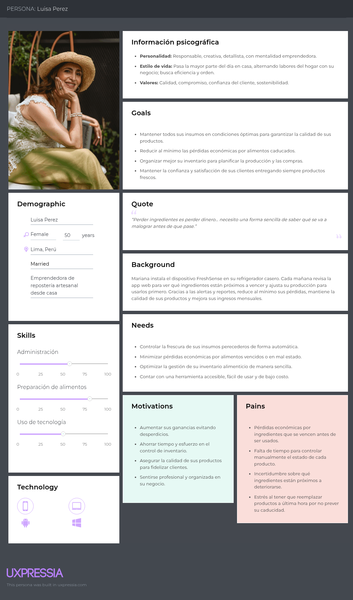<br>
### 2.3.2. User Task Matrix
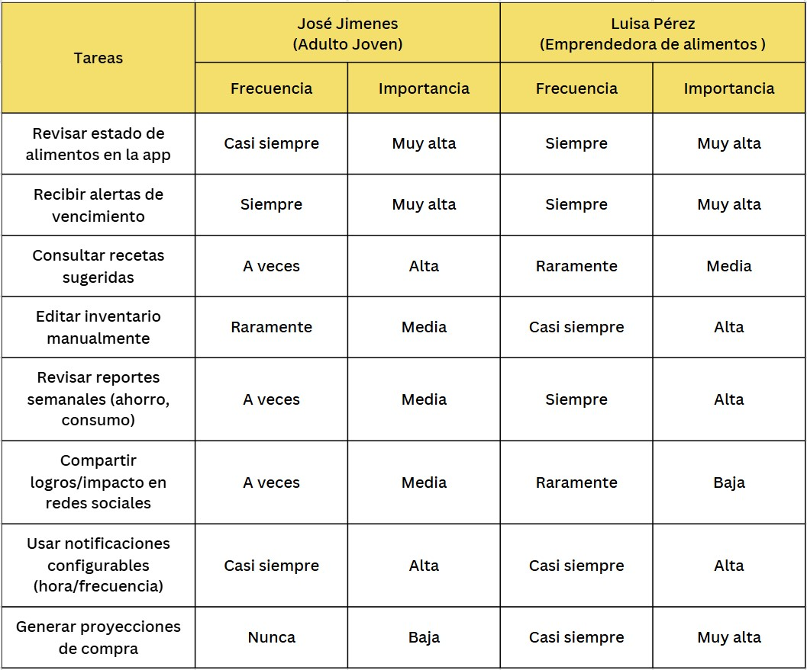
Las tareas más frecuentes para los perfiles de usuario en FreshSense muestran claras diferencias según el rol y las necesidades de cada segmento.

José Jiménez, como adulto joven con poco tiempo libre, usa la aplicación principalmente para consultar el estado de sus alimentos y recibir alertas de vencimiento, funciones que considera muy importantes para evitar pérdidas y ahorrar dinero. Además, interactúa ocasionalmente con las recetas sugeridas para variar su dieta y con la función de compartir logros en redes sociales, aunque estas últimas no son prioritarias en su experiencia.

En contraste, Luisa Pérez, como emprendedora de alimentos caseros, enfoca su uso en el control detallado del inventario y en la revisión de reportes y proyecciones de compra, funciones que tienen gran importancia para asegurar la calidad de sus productos y reducir mermas en su negocio. Aunque consulta recetas con poca frecuencia, valora más la gestión manual del inventario y los reportes para planificar mejor la producción.
### 2.3.3. User Journey Mapping
Segmento 1:

Mediante este artefacto se explicará y comprenderá cómo los usuarios del segmento 1 realizan sus actividades para gestionar sus alimentos y evitar desperdicios desde su propia perspectiva. Este segmento representa a personas con un estilo de vida dinámico, que suelen olvidar revisar con frecuencia su refrigerador y terminan desechando productos en mal estado. Valoran soluciones tecnológicas simples y rápidas que les permitan recibir alertas oportunas, optimizar el consumo mediante recetas prácticas y tener un mayor control de su inventario sin invertir tiempo adicional.
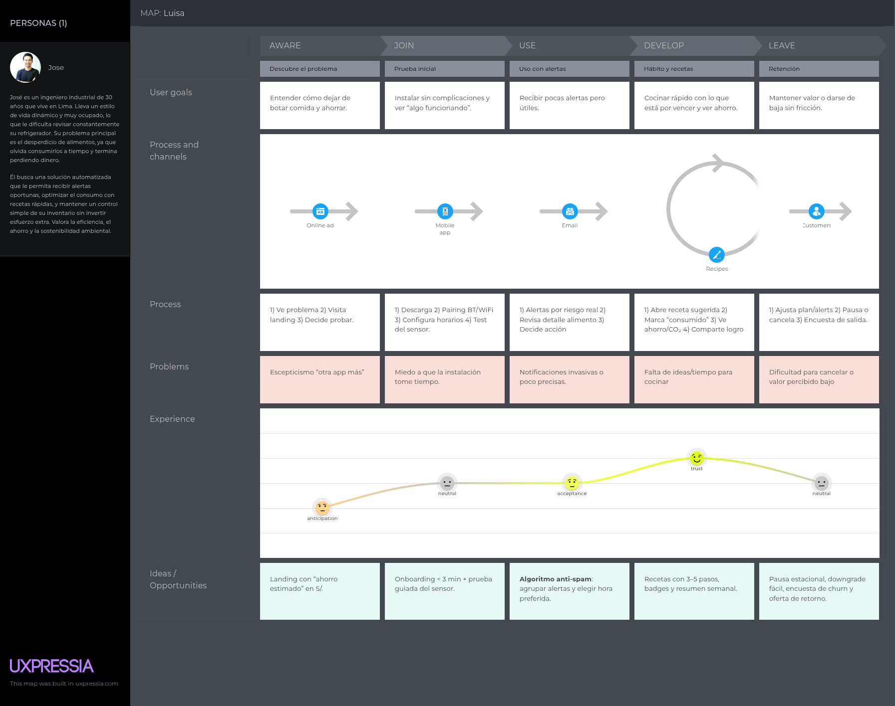

Segmento 2: 

Mediante este artefacto se explicará y comprenderá cómo los usuarios del segmento 2 realizan sus actividades para mantener el control de sus insumos y asegurar la frescura de los productos que ofrecen a sus clientes. Este segmento representa a pequeños negocios que trabajan desde casa y enfrentan pérdidas económicas por caducidad de insumos debido a la gestión manual. Valoran herramientas que automaticen el monitoreo de la frescura, brinden reportes y proyecciones de compra, y contribuyan a mantener la calidad y la confianza de sus clientes, garantizando así la sostenibilidad de su negocio.
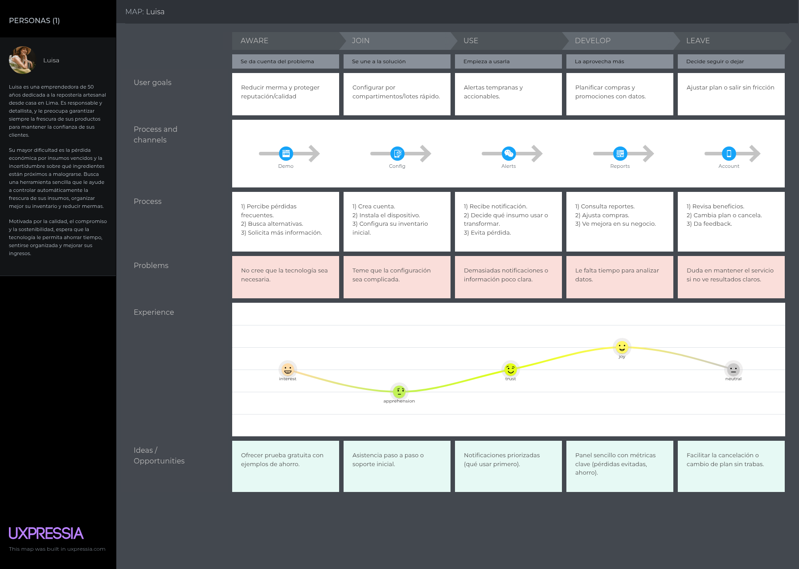

### 2.3.4. Empathy Mapping
### 2.3.5. As-is Scenario Mapping
Segmento 1:

Mediante este artefacto, se ha realizado la elaboración del As-is Scenario Mapping para el primer segmento (Adultos jóvenes). Este escenario refleja cómo los usuarios con un estilo de vida ocupado gestionan actualmente sus alimentos, dependiendo en gran medida de la memoria o revisiones esporádicas del refrigerador. Se evidencian las dificultades que enfrentan al olvidar productos, los gastos innecesarios por alimentos desperdiciados y la frustración al no contar con un sistema que los apoye en la organización. Asimismo, se muestran las percepciones y emociones que experimentan en cada etapa de su recorrido, desde la compra hasta el descarte de los productos.
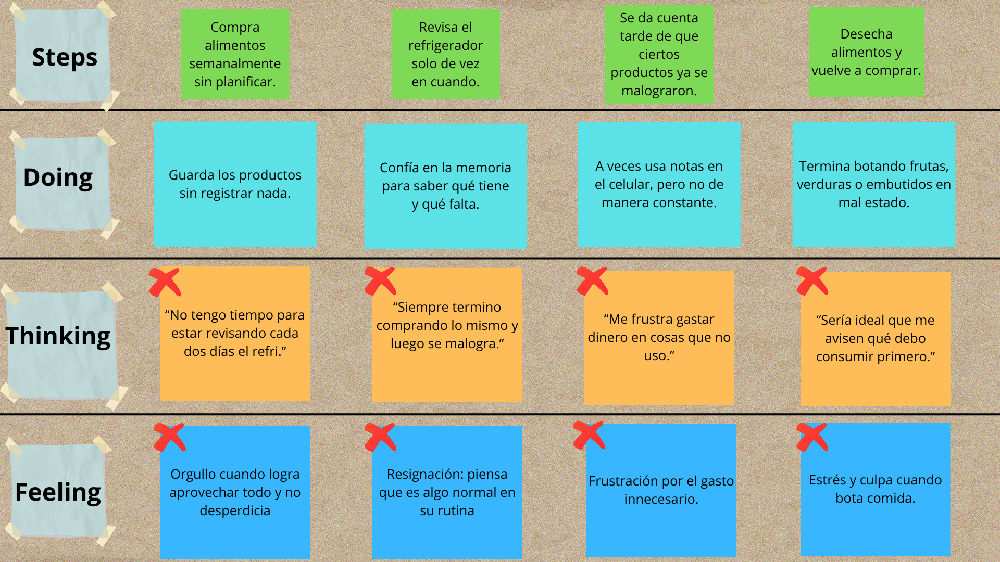

Segmento 2:

Mediante este artefacto, se ha llevado a cabo la elaboración del As-is Scenario Mapping para el segundo segmento (Emprendedores de alimentos caseros). Este escenario refleja cómo los usuarios que producen y venden alimentos gestionan sus insumos de manera manual, utilizando cuadernos o archivos de Excel para llevar el control de su inventario. Se identifican las dificultades que enfrentan por pérdidas de productos caducados, la incertidumbre al no contar con alertas oportunas y el impacto económico negativo en su negocio. Asimismo, se destacan las percepciones y emociones que surgen en cada etapa, como el estrés por la gestión manual, la preocupación por mantener la calidad y la satisfacción de los clientes, y la presión constante de evitar pérdidas que afectan sus ingresos.
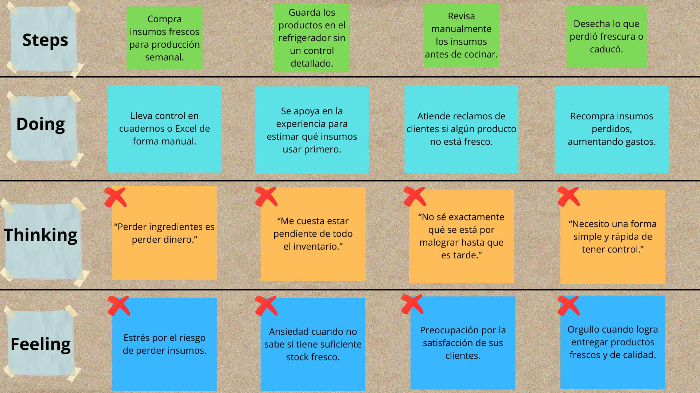

## 2.4. Big Picture EventStorming


## 2.5. Ubiquitous Language

| Ubiquos Term          | Definition of Functional Domain                                                         | 
|-----------------------|-----------------------------------------------------------------------------------------|
| Food Waste            | Loss or discard of edible food that could have been consumed, caused by poor management, lack of monitoring, or premature spoilage. |
| FreshSense Device     | Sensor-based hardware placed inside the refrigerator to monitor food conditions such as temperature, humidity, and ethylene gas levels.|
| Ethylene Gas          | Natural plant hormone released by fruits and vegetables during ripening. In FreshSense, ethylene gas is considered an indicator of freshness: high levels mean food is ripening faster and may spoil soon. |
| Food Inventory        | List and status of available food items stored at home or in small businesses, including expiration estimation. |
| Food Condition        | Current state of stored food measured by FreshSense (fresh, at risk, or spoiled). |
| Expiration Alert      | Notification sent to users when a food item is approaching spoilage or expiration. |
| Recipe Suggestion     | Cooking recommendation generated by the app based on ingredients close to expiration. |
| Consumption Report    | Weekly or monthly summary of food consumed, discarded, and saved, showing economic and environmental impact. |
| Premium Subscription  | Paid plan offering advanced features such as detailed inventory analysis, personalized recipes, and environmental statistics. |
| Household User        | Individual or family that uses FreshSense at home to manage their food and reduce waste. |
| Food Entrepreneur     | Small business owner or person who sells homemade food and uses FreshSense to guarantee freshness and reduce losses. |
| Sustainability Impact | Positive effect of reducing food waste, measured in terms of money saved, CO₂ emissions avoided, and responsible consumption. |
| Gamification          | Use of challenges, badges, and achievements within the app to motivate users to reduce waste. |
| Food Monitoring      | Continuous tracking of storage conditions and freshness status of food. |
| Smart Notification   | Alert system customized to user preferences, avoiding excessive or irrelevant reminders. |
| Recipe Filter       | User option to search recipes by difficulty, time, or dietary preference. |

# Capítulo III: Requirements Specification
## 3.1. To-Be Scenario Mapping
### Segmento #1 : Adultos jóvenes
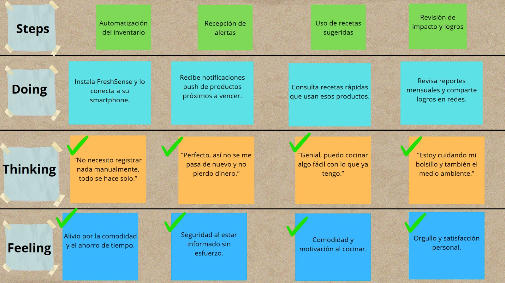
### Segmento #2 : Pequeños negocios / emprendedores de alimentos caseros
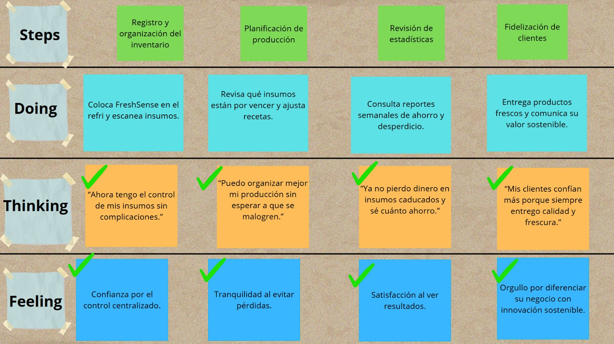
## 3.2. User Stories

| Epic / User Story ID | Título       | Descripción | Criterios de Aceptación  | Relacionado con (Epic ID) |
|---------------------|---------------------------------|---------------------------------------------------------------------------------------------------------------------|----------------------------------------------------------------------------------------------------------------------------------------------------------------------------------------------------------------------------------------------------------|---------------------------|
| US01  | Visualización propuesta| Como visitante adulto joven, quiero entender rápidamente la propuesta de FreshSense para valorar su utilidad. | **Escenario 1: Página carga correctamente** <br> Dado que un visitante accede al sitio <br> Cuando la landing page carga <br> Entonces el visitante ve el mensaje principal y el valor de la solución claramente.        | EP01 |
| US02  | Sección para pequeños negocios  | Como visitante emprendedor, quiero información dedicada para sentirme identificado y entender beneficios. | **Escenario 1: Sección visible** <br> Dado que un emprendedor accede a la landing page <br> Cuando navega por la página <br> Entonces ve secciones y beneficios específicos para su perfil.     | EP01 |
| US03  | Formulario de contacto | Como visitante, quiero un formulario simple para solicitar información o demo fácilmente.    | **Escenario 1: Formulario accesible** <br> Dado que un visitante quiere contactar <br> Cuando accede a la sección de contacto <br> Entonces puede enviar un formulario con datos válidos.        | EP01 |
| US04  | CTA para suscripción| Como visitante interesado, quiero un llamado claro a la acción para iniciar una suscripción o prueba gratis. | **Escenario 1: Botón visible y funcional** <br> Dado que un visitante navega la página <br> Cuando llega a la sección de suscripción <br> Entonces el visitante ve y puede usar un botón llamativo para iniciar suscripción o prueba.    | EP01 |
| US05  | Compatibilidad móvil| Como visitante, quiero que la landing page funcione correctamente en móviles para informarme desde cualquier dispositivo. | **Escenario 1: Diseño responsivo** <br> Dado que un visitante usa un dispositivo móvil <br> Cuando accede a la landing page <br> Entonces la página se adapta y muestra el contenido correctamente.   | EP01 |
| US06   | Monitoreo de alimentos | Como usuario doméstico, quiero que el sensor mida temperatura, humedad y etileno para conocer el estado real de mis alimentos y evitar desperdicios. | **Escenario 1: Registro exitoso de datos**  <br> Dado que el sensor está activo y funcionando correctamente <br> Cuando detecta variaciones en las mediciones <br> Entonces la información se envía a la aplicación en tiempo real <br> Y la información es actualizada en el sistema correctamente. <br><br> **Escenario 2: Error de conexión** <br> Dado que el sensor pierde conexión o hay fallo en la transmisión <br> Cuando el sistema detecta la pérdida de señal <br> Entonces la aplicación muestra un mensaje de error <br> Y sugiere al usuario intentar reconectar el sensor. | EP02   |
| US07   | Visualización de inventario      | Como usuario, quiero ver en la app el estado de cada alimento para identificar cuáles están en riesgo y gestionarlos mejor. | **Escenario 1: Vista con colores** <br> Dado que el usuario accede al panel y abre la app <br> Cuando la app carga la información <br> Entonces debe mostrar el estado con colores diferenciados (verde, amarillo, rojo). <br><br> **Escenario 2: Detalle de alimento** <br> Dado que el usuario selecciona un alimento <br> Cuando se muestra la información detallada <br> Entonces debe ver la fecha estimada de caducidad y las condiciones actuales del alimento. | EP02   |
| US08   | Alertas anticipadas | Como usuario, quiero recibir alertas cuando un alimento esté por vencer para poder consumirlo a tiempo y evitar pérdidas. | **Escenario 1: Generar alerta** <br> Dado que un alimento está próximo a caducar <br> Cuando se detecta el riesgo de vencimiento <br> Entonces el sistema envía una notificación de alerta al usuario. <br><br> **Escenario 2: No generar alerta innecesaria** <br> Dado que no hay alimentos en riesgo <br> Cuando se realiza la verificación <br> Entonces no deben generarse notificaciones. | EP03   |
| US09   | Configuración de notificaciones | Como usuario, quiero configurar la hora y frecuencia de las notificaciones para evitar que sean invasivas y molestas. | **Escenario 1: Configuración exitosa** <br> Dado que el usuario ingresa parámetros válidos de tiempo y frecuencia <br> Cuando guarda la configuración <br> Entonces el sistema aplica las preferencias. <br><br> **Escenario 2: Error en configuración** <br> Dado que el usuario ingresa parámetros inválidos <br> Cuando intenta guardar la configuración <br> Entonces el sistema muestra un mensaje de error indicando el valor incorrecto. | EP03   |
| US10   | Registro automático de alimentos | Como usuario, quiero registrar mis alimentos mediante voz o escáner para ahorrar tiempo y facilitar el ingreso.      | **Escenario 1: Registro por voz** <br> Dado que el usuario proporciona un comando de voz con los productos comprados <br> Cuando la app procesa el comando <br> Entonces registra los productos mencionados. <br><br> **Escenario 2: Registro por escaneo** <br> Dado que el usuario escanea un código válido <br> Cuando la app procesa el escaneo <br> Entonces registra automáticamente el producto en el inventario. | EP04   |
| US11   | Edición de inventario  | Como usuario, quiero editar manualmente mi inventario para mantenerlo actualizado y corregir errores.  | **Escenario 1: Edición exitosa** <br> Dado que el usuario modifica la cantidad o fecha de un alimento <br> Cuando guarda los cambios <br> Entonces la app actualiza el inventario correctamente. <br><br> **Escenario 2: Error en edición** <br> Dado que el usuario ingresa datos inválidos <br> Cuando intenta guardar <br> Entonces la app muestra un mensaje de error indicando el problema. | EP04   |
| US12   | Resumen semanal   | Como usuario, quiero recibir un reporte semanal de mis alimentos consumidos y desperdiciados para mejorar hábitos.  | **Escenario 1: Generación de reporte** <br> Dado que ha pasado una semana desde el último reporte <br> Cuando se genera el reporte semanal <br> Entonces el usuario puede verlo en la app. <br><br> **Escenario 2: Envío por correo** <br> Dado que el usuario tiene activada la opción de correo <br> Cuando el reporte es generado <br> Entonces se envía automáticamente al correo registrado. | EP04 |
| US13   | Recetas personalizadas | Como usuario, quiero recibir recetas basadas en alimentos próximos a caducar para aprovechar mejor mis ingredientes. | **Escenario 1: Recetas con ingredientes en riesgo** <br> Dado que el usuario tiene productos próximos a vencer <br> Cuando consulta las recetas <br> Entonces la app muestra recetas que incluyen esos ingredientes. <br><br> **Escenario 2: Recetas generales** <br> Dado que no hay productos en riesgo <br> Cuando el usuario consulta recetas <br> Entonces la app muestra recetas generales y variadas. | EP05   |
| US14   | Filtros de recetas  | Como usuario, quiero filtrar recetas por dificultad, tiempo o dieta para encontrar opciones adaptadas a mi vida.    | **Escenario 1: Aplicación de filtro** <br> Dado que el usuario selecciona un filtro (dificultad, tiempo, dieta) <br> Cuando solicita ver las recetas filtradas <br> Entonces la app muestra sólo las recetas que cumplen el filtro. <br><br> **Escenario 2: Sin coincidencias** <br> Dado que no existen recetas bajo el filtro seleccionado <br> Cuando el usuario aplica el filtro <br> Entonces la app muestra mensaje “no se encontraron recetas”. | EP05   |
| US15   | Tutorial interactivo| Como usuario nuevo, quiero un tutorial inicial y repetible para aprender a usar la app.| **Escenario 1: Visualización al inicio** <br> Dado que el usuario es nuevo <br> Cuando inicia la app por primera vez <br> Entonces ve un tutorial interactivo. <br><br> **Escenario 2: Repetición del tutorial** <br> Dado que el usuario solicita ayuda <br> Cuando accede a “Ayuda” <br> Entonces puede repetir el tutorial en cualquier momento. | EP06   |
| US16   | Interfaz atractiva  | Como usuario, quiero una interfaz sencilla y atractiva que me motive a usar la app y facilite la navegación.       | **Escenario 1: Diseño usable** <br> Dado que el usuario navega por la app <br> Cuando usa los menús y opciones <br> Entonces la interfaz es clara y accesible. <br><br> **Escenario 2: Reporte de error** <br> Dado que un botón está mal configurado <br> Cuando el usuario lo intenta usar <br> Entonces la app notifica al equipo técnico sobre el error. | EP06   |
| US17   | Análisis detallado de inventario | Como usuario premium, quiero análisis detallado de mis alimentos para optimizar compras y control.    | **Escenario 1: Acceso a reporte avanzado** <br> Dado que el usuario tiene plan premium activo <br> Cuando accede a análisis de inventario <br> Entonces puede ver métricas detalladas. <br><br> **Escenario 2: Restricción para no premium** <br> Dado que el usuario no tiene plan premium <br> Cuando intenta acceder a análisis avanzado <br> Entonces se muestra aviso “Función disponible en plan premium”. | EP07   |
| US18   | Estadísticas de ahorro  | Como usuario premium, quiero ver estadísticas de ahorro económico y reducción de desperdicio para evaluar impacto. | **Escenario 1: Visualización de estadísticas** <br> Dado que el usuario está en plan premium <br> Cuando revisa su perfil <br> Entonces ve estadísticas de ahorro acumulado. <br><br> **Escenario 2: Sin datos disponibles** <br> Dado que el usuario es nuevo en el plan premium <br> Cuando accede a estadísticas <br> Entonces ve mensaje “aún no hay estadísticas”. | EP07   |
| US19   | Recetas exclusivas premium       | Como usuario premium, quiero recetas avanzadas para aprovechar ingredientes y diversidad.     | **Escenario 1: Acceso permitido a recetas** <br> Dado que el usuario tiene plan premium <br> Cuando accede a la sección recetas exclusivas <br> Entonces puede ver y usar las recetas. <br><br> **Escenario 2: Acceso denegado** <br> Dado que el usuario no tiene plan premium <br> Cuando intenta acceder a recetas exclusivas <br> Entonces no tiene acceso. | EP07   |
| US20   | Reporte de impacto ambiental    | Como usuario, quiero ver reporte mensual del impacto ambiental evitado para conocer mi contribución.  | **Escenario 1: Generación del reporte** <br> Dado que el usuario accede a su perfil <br> Cuando consulta el reporte mensual <br> Entonces ve el impacto acumulado (ej. kg de CO₂ ahorrados). <br><br> **Escenario 2: Sin datos registrados** <br> Dado que no hay datos de consumo <br> Cuando accede al reporte <br> Entonces el sistema muestra mensaje “aún no hay datos”. | EP08   |
| US21   | Compartir logros en redes        | Como usuario, quiero compartir logros de reducción de desperdicio en redes sociales para inspirar a otros.        | **Escenario 1: Compartir éxito** <br> Dado que el usuario presiona “Compartir” <br> Cuando la app genera contenido visual <br> Entonces se publica en la red social seleccionada. <br><br> **Escenario 2: Error de conexión** <br> Dado que la red social no responde <br> Cuando intenta publicar <br> Entonces la app muestra mensaje de error. | EP08   |
| US22   | Sincronización con smart fridges | Como usuario, quiero que FreshSense se integre con refrigeradores inteligentes para recibir datos combinados y mejorar la precisión. | **Escenario 1: Integración exitosa** <br> Dado que el frigorífico es compatible y la integración está activada <br> Cuando se sincronizan datos <br> Entonces la app muestra información combinada correctamente. <br><br> **Escenario 2: Error en integración** <br> Dado que la conexión falla <br> Cuando el sistema detecta el error <br> Entonces notifica al usuario. | EP09   |
| US23   | Control por voz con asistentes   | Como usuario, quiero controlar funciones básicas mediante asistentes de voz (Alexa, Google) para facilitar el uso.  | **Escenario 1: Comando recibido y ejecutado** <br> Dado que el usuario emite un comando de voz <br> Cuando el sistema recibe el comando <br> Entonces confirma la acción con respuesta audible o visual. <br><br> **Escenario 2: Configuración correcta** <br> Dado que el usuario configura la integración de voz <br> Cuando termina la configuración <br> Entonces la función queda habilitada. <br><br> **Escenario 3: Sin integración activa** <br> Dado que no está configurada la integración <br> Cuando se recibe comando <br> Entonces el sistema no acepta el comando y notifica al usuario. | EP09   |
| US24   | Notificaciones personalizadas    | Como usuario, quiero configurar qué notificaciones recibir y a qué dispositivo para no ser molestado innecesariamente. | **Escenario 1: Selección de preferencias y guardado** <br> Dado que el usuario abre configuración de notificaciones <br> Cuando selecciona tipos y horarios <br> Entonces la app guarda las preferencias. <br><br> **Escenario 2: Envío filtrado de notificaciones** <br> Dado que las preferencias están guardadas <br> Cuando llega una notificación <br> Entonces solo se envía a los dispositivos configurados. <br><br> **Escenario 3: Activar o desactivar alertas** <br> Dado que el usuario cambia el estado de alertas <br> Cuando termina la acción <br> Entonces la app aplica el cambio correctamente. | EP09   |
| US25   | Logros y recompensas| Como usuario, quiero ganar logros por uso frecuente y reducción de desperdicio para motivarme a continuar usándola. | **Escenario 1: Registro y otorgamiento de logros** <br> Dado que el usuario cumple metas de uso y reducción <br> Cuando el sistema registra el progreso <br> Entonces otorga badges o puntos. <br><br> **Escenario 2: Visualización de logros** <br> Dado que hay logros obtenidos <br> Cuando el usuario accede a su perfil <br> Entonces ve los logros mostrados. <br><br> **Escenario 3: Notificación de nuevos logros** <br> Dado que se gana un nuevo logro <br> Cuando el sistema lo actualiza <br> Entonces notifica al usuario. | EP10   |
| US26   | Compartir en redes sociales      | Como usuario, quiero compartir mis logros en redes sociales para inspirar a otros a reducir desperdicio.| **Escenario 1: Compartir exitoso** <br> Dado que el usuario presiona “Compartir” <br> Cuando se genera el contenido visual <br> Entonces publica en la red social seleccionada. <br><br> **Escenario 2: Error al compartir** <br> Dado que la red social no responde correctamente <br> Cuando se intenta publicar <br> Entonces la app muestra mensaje de error y opción para reintentar. | EP10   |
| US27   | Retos y competencias| Como usuario, quiero participar en retos para incentivar la reducción de desperdicio y ganar premios. | **Escenario 1: Inscripción en retos** <br> Dado que la app ofrece retos activos <br> Cuando el usuario se inscribe <br> Entonces puede comenzar a participar y ver su avance. <br><br> **Escenario 2: Visualización del ranking** <br> Dado que el reto está activo <br> Cuando el usuario consulta posiciones <br> Entonces muestra tabla de ranking actualizada. <br><br> **Escenario 3: Salir del reto** <br> Dado que el usuario decide abandonar un reto <br> Cuando pide salir <br> Entonces la app lo elimina efectivamente del reto. | EP10   |
| US28   | Categorías personalizadas        | Como usuario, quiero crear y asignar categorías para organizar mis alimentos según mis preferencias.  | **Escenario 1: Crear nueva categoría** <br> Dado que el usuario solicita crear una categoría <br> Cuando ingresa nombre válido <br> Entonces la categoría se crea y guarda. <br><br> **Escenario 2: Asignar categoría a alimentos** <br> Dado que existen categorías disponibles <br> Cuando el usuario asigna alimentos a una categoría <br> Entonces la asignación se refleja correctamente. <br><br> **Escenario 3: Persistencia de categorías** <br> Dado que el usuario vuelve a la app <br> Cuando carga la vista del inventario <br> Entonces las categorías creadas están visibles y asignadas. | EP11   |
| US29   | Historial de consumo| Como usuario, quiero consultar un historial para analizar hábitos y ajustar compras futuras.     | **Escenario 1: Registro de consumo** <br> Dado que el usuario consume o descarta un alimento <br> Cuando se actualiza el inventario <br> Entonces se registra fecha y acción en historial. <br><br> **Escenario 2: Visualización del historial** <br> Dado que hay datos registrados <br> Cuando el usuario accede a historial <br> Entonces muestra listado y gráficas ordenadas por fecha. <br><br> **Escenario 3: Filtrar y exportar datos** <br> Dado que el usuario aplica filtros específicos <br> Cuando solicita exportar datos <br> Entonces puede descargar información en formato común (CSV, Excel). | EP11   |
| US30   | Sugerencias de compra  | Como usuario, quiero recibir sugerencias basadas en inventario y consumo para evitar faltantes y excesos.      | **Escenario 1: Generación de recomendaciones** <br> Dado que hay datos de inventario y consumo <br> Cuando la app analiza información <br> Entonces genera sugerencias pertinentes. <br><br> **Escenario 2: Envío de notificaciones periódicas** <br> Dado que la función está habilitada <br> Cuando es momento de enviar notificaciones <br> Entonces el usuario recibe recomendaciones semanales o mensuales. <br><br> **Escenario 3: Personalización de sugerencias** <br> Dado que el usuario modifica preferencias <br> Cuando guarda configuraciones <br> Entonces recomendaciones futuras se ajustan según preferencias. | EP11   |
| TS31   | API para registro de sensores    | Como developer, necesito una API que reciba y almacene datos de sensores para mantener actualizado el estado de alimentos. | **Escenario 1: Recepción exitosa** <br> Dado que el sensor envía datos válidos <br> Cuando el API recibe el request <br> Entonces responde con éxito y almacena los datos correctamente.        | EP12 |
| TS32   | API para envío de notificaciones | Como developer, necesito un endpoint para enviar notificaciones basadas en alertas de sensores.| **Escenario 1: Notificación enviada** <br> Dado que hay una alerta activa <br> Cuando se llama al endpoint <br> Entonces se envía la notificación al usuario correspondiente.  | EP12 |
| TS33   | API para gestión de usuarios| Como developer, necesito que el API permita administrar roles y permisos para controlar acceso a funciones premium. | **Escenario 1: Actualización exitosa** <br> Dado que un admin realiza un cambio válido <br> Cuando se procesa el request <br> Entonces el API actualiza correctamente los permisos del usuario.| EP12 |

## Epics

| Epic ID | Título   | Descripción corta  |
|---------|-----------------------------------------|------------------------------------------------------------------------------------------------------------|
| EP01    | Sitio web estático (Landing Page)   | Contenido e interacción para visitantes y segmentos, vinculados a la experiencia web y generación de leads.   |
| EP02    | Monitoreo de alimentos| Gestionar en tiempo real el estado de frutas, verduras y perecibles con sensores de temperatura, humedad y gas etileno. |
| EP03    | Alertas y notificaciones inteligentes    | Avisar a los usuarios cuando un alimento esté próximo a vencer o deteriorarse con alertas personalizadas.|
| EP04    | Gestión de inventario alimenticio   | Permitir registrar, visualizar y organizar los alimentos disponibles en el refrigerador, con reportes periódicos. |
| EP05    | Recetas personalizadas| Recomendar preparaciones basadas en ingredientes disponibles para fomentar su consumo eficiente.|
| EP06    | Experiencia de usuario y accesibilidad   | Garantizar una app intuitiva, visualmente atractiva y fácil de usar, con tutoriales para nuevos usuarios.|
| EP07    | Modelo de suscripción premium| Ofrecer planes pagos con funciones avanzadas como análisis detallado de inventario, estadísticas y recetas exclusivas. |
| EP08    | Impacto ambiental y sostenibilidad  | Promover la reducción del desperdicio y concientizar sobre el ahorro económico y ecológico.|
| EP09    | Integración con dispositivos inteligentes| Facilitar la conexión y sincronización de FreshSense con refrigeradores inteligentes y asistentes de voz.|
| EP10    | Comunidad y gamificación    | Fomentar motivación y compromiso usando logros, retos y la posibilidad de compartir avances en redes sociales.|
| EP11    | Gestión avanzada de inventario | Proveer herramientas para organización, análisis y optimización del inventario con categorías e historial.    |
| EP12  | RESTful API | Back-end para funcionalidades centrales incluyendo gestión de sensores, notificaciones y usuarios. |

## 3.3. Impact Mapping
El Impact Mapping de FreshSense se elaboró con el propósito de vincular las metas estratégicas de la startup con las necesidades de los usuarios y las funcionalidades priorizadas. Esta herramienta permite visualizar de manera clara la relación entre el Business Goal, los User Personas, los cambios de comportamiento esperados (Impacts), las funcionalidades propuestas (Deliverables) y las User Stories asociadas.

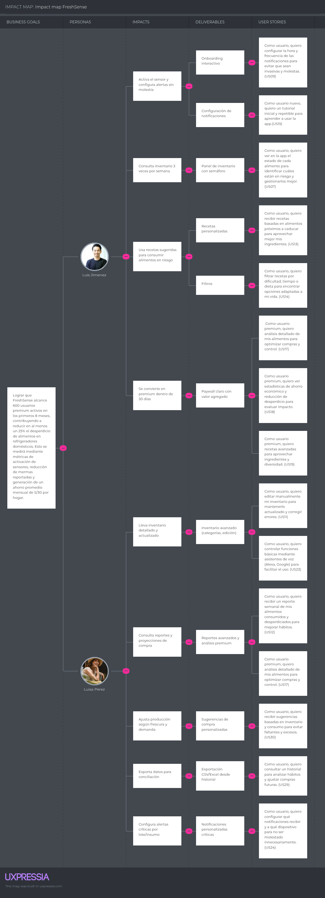

En conclusión, el Impact Mapping permitió establecer una trazabilidad clara entre la estrategia de negocio y la implementación del producto. Esto asegura que las funcionalidades priorizadas no solo atiendan a los requerimientos técnicos, sino que generen un impacto real en los hábitos de consumo de los usuarios, reduzcan el desperdicio alimentario y fortalezcan el modelo de negocio de FreshSense.

## 3.4. Product Backlog
| # Orden | User Story ID | Título                                | Descripción                                                                 | Story Points (1 / 2 / 3 / 5 / 8) |
|--------:|---------------|----------------------------------------|-----------------------------------------------------------------------------|----------------------------------|
| 1       | US01          | Visualización propuesta                | Como visitante adulto joven, quiero entender rápidamente la propuesta de FreshSense para valorar su utilidad. | 2 |
| 2       | US02          | Sección para pequeños negocios         | Como visitante emprendedor, quiero información dedicada para sentirme identificado y entender beneficios. | 2 |
| 3       | US03          | Formulario de contacto                 | Como visitante, quiero un formulario simple para solicitar información o demo fácilmente. | 2 |
| 4       | US04          | CTA para suscripción                   | Como visitante interesado, quiero un llamado claro a la acción para iniciar una suscripción o prueba gratis. | 2 |
| 5       | US05          | Compatibilidad móvil                   | Como visitante, quiero que la landing funcione correctamente en móviles. | 3 |
| 6       | US06          | Monitoreo de alimentos                 | Como usuario doméstico, quiero que el sensor mida temperatura, humedad y etileno. | 5 |
| 7       | US07          | Visualización de inventario            | Como usuario, quiero ver el estado de cada alimento e identificar riesgos. | 3 |
| 8       | US08          | Alertas anticipadas                    | Como usuario, quiero recibir alertas cuando un alimento esté por vencer. | 5 |
| 9       | US09          | Configuración de notificaciones        | Como usuario, quiero configurar hora y frecuencia de notificaciones. | 3 |
| 10      | US10          | Registro automático de alimentos       | Como usuario, quiero registrar alimentos por voz o escaneo. | 5 |
| 11      | US11          | Edición de inventario                  | Como usuario, quiero editar manualmente mi inventario. | 2 |
| 12      | US12          | Resumen semanal                        | Como usuario, quiero recibir un reporte semanal de consumo y desperdicio. | 3 |
| 13      | US13          | Recetas personalizadas                 | Como usuario, quiero recetas basadas en alimentos próximos a caducar. | 5 |
| 14      | US14          | Filtros de recetas                     | Como usuario, quiero filtrar recetas por dificultad, tiempo o dieta. | 3 |
| 15      | US15          | Tutorial interactivo                   | Como usuario nuevo, quiero un tutorial inicial y repetible. | 2 |
| 16      | US16          | Interfaz atractiva                     | Como usuario, quiero una interfaz sencilla y motivadora. | 3 |
| 17      | US17          | Análisis detallado de inventario       | Como usuario premium, quiero análisis detallado para optimizar compras. | 5 |
| 18      | US18          | Estadísticas de ahorro                 | Como usuario premium, quiero ver ahorro económico y reducción de desperdicio. | 3 |
| 19      | US19          | Recetas exclusivas premium             | Como usuario premium, quiero recetas avanzadas. | 2 |
| 20      | US20          | Reporte de impacto ambiental           | Como usuario, quiero ver reporte mensual de impacto ambiental evitado. | 3 |
| 21      | US21          | Compartir logros en redes              | Como usuario, quiero compartir mis logros en redes sociales. | 2 |
| 22      | US22          | Sincronización con smart fridges       | Como usuario, quiero integrar refrigeradores inteligentes. | 8 |
| 23      | US23          | Control por voz con asistentes         | Como usuario, quiero controlar funciones con Alexa/Google Assistant. | 5 |
| 24      | US24          | Notificaciones personalizadas          | Como usuario, quiero configurar qué notificaciones recibir y a qué dispositivo. | 3 |
| 25      | US25          | Logros y recompensas                   | Como usuario, quiero ganar logros por uso y reducción de desperdicio. | 3 |
| 26      | US26          | Compartir en redes sociales            | Como usuario, quiero compartir mis logros para inspirar a otros. | 2 |
| 27      | US27          | Retos y competencias                   | Como usuario, quiero participar en retos para reducir desperdicio. | 5 |
| 28      | US28          | Categorías personalizadas              | Como usuario, quiero crear y asignar categorías propias. | 3 |
| 29      | US29          | Historial de consumo                   | Como usuario, quiero consultar historial para analizar hábitos. | 5 |
| 30      | US30          | Sugerencias de compra                  | Como usuario, quiero sugerencias basadas en inventario y consumo. | 5 |
| 31      | TS31          | API para registro de sensores          | Como developer, necesito una API que reciba y almacene datos de sensores. | 5 |
| 32      | TS32          | API para envío de notificaciones       | Como developer, necesito un endpoint para enviar notificaciones basadas en alertas. | 3 |
| 33      | TS33          | API para gestión de usuarios           | Como developer, necesito que el API permita administrar roles y permisos. | 5 |

# Capítulo IV: Product Design

El desarrollo de FreshSense requiere establecer un conjunto de lineamientos visuales y de interacción que aseguren la coherencia de la experiencia en todas sus interfaces. Para ello, se definen estándares generales aplicables a todo el ecosistema del producto, así como guías específicas para la aplicación web. Estos lineamientos están inspirados en principios de diseño como consistencia, simplicidad, accesibilidad y comunicación clara, garantizando una experiencia confiable y atractiva para los usuarios finales.

## 4.1. Style Guidelines

Los lineamientos generales proporcionan una base visual y comunicacional uniforme que sirve como referencia para cualquier pieza del producto FreshSense.

### 4.1.1. General Style Guidelines

Los lineamientos generales proporcionan una base visual y comunicacional uniforme que sirve como referencia para cualquier pieza del producto FreshSense, ya sea en medios digitales, impresos o presentaciones institucionales.

**Branding:**

El logo de FreshSense transmite innovación y sostenibilidad, con un estilo limpio que simboliza frescura y control. Se privilegia el uso de elementos visuales asociados a alimentos, frescura y naturaleza, lo cual refuerza la misión de reducir el desperdicio de alimentos mediante tecnología.


**Typography:**

La tipografía de FreshSense fue seleccionada con el objetivo de transmitir modernidad, simplicidad y legibilidad en cualquier dispositivo digital. Se adoptó la familia Poppins, ampliamente utilizada en interfaces web por su estilo limpio y adaptable. La definición de jerarquías tipográficas claras (H1, H2, H3 y párrafo) asegura una correcta organización de la información, permitiendo que los títulos resalten con fuerza mientras los textos de párrafo mantienen una lectura cómoda y fluida.

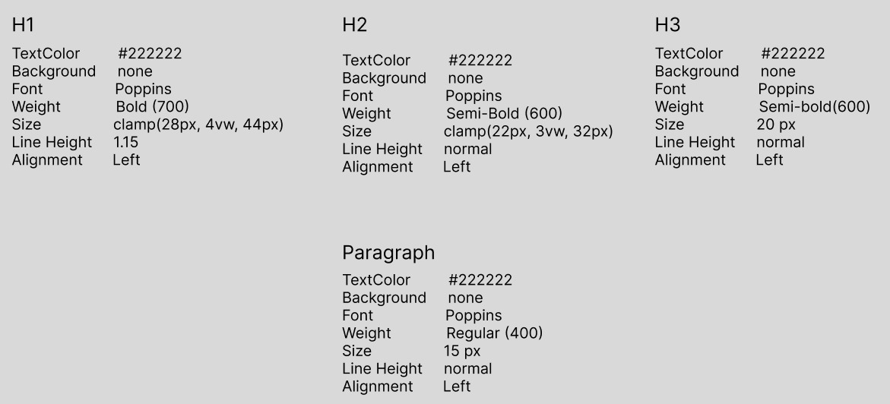

**Colors:**

La paleta cromática de FreshSense refleja los valores de frescura, sostenibilidad y confianza que inspiran al producto. Los tonos verdes y azules transmiten vitalidad y dinamismo, mientras que los grises y el blanco generan equilibrio, limpieza y contraste. Esta selección no solo aporta coherencia visual a la marca, sino que también mejora la accesibilidad y la experiencia del usuario en diferentes contextos y dispositivos.

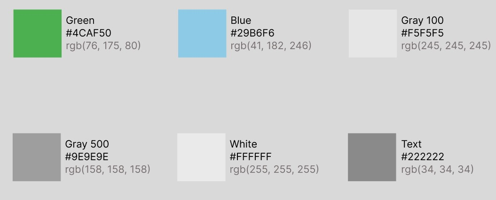

Uso de colores:

- Green (Prymary): Botones primarios, acentos principales
- Blue (Secondary): fondos de tarjetas y secciones suaves
- Gray 500 (Neutral Text / Secondary): textos secundarios, íconos, labels
- White (Background / Contrast): fondo principal, tarjetas, espacios en blanco
- Text (Base): color de texto principal

**Spacing & Layout:**

La organización del espacio en FreshSense se fundamenta en una estructura modular que garantiza orden, coherencia y equilibrio visual en todas las interfaces. El uso de un sistema de grillas y una unidad base de espaciado permite mantener consistencia entre secciones, componentes y tipografías, asegurando una experiencia clara y agradable para el usuario. Asimismo, la aplicación de márgenes amplios y paddings uniformes favorece la legibilidad y resalta los elementos clave, transmitiendo una sensación de limpieza y simplicidad.

Base Unit
- Size: 8 px
- Uso: unidad mínima para márgenes, paddings y separación entre elementos.

Grid System
- Grid: 12 columnas
- Gutter: 22 px
- Margins: proporcionales a la unidad base (múltiplos de 8 px)

Section Spacing
- Padding vertical: 56 px (sección estándar)
- Hero section: 72 px
- Footer: 36–56 px

Cards & Components
- Padding interno: 18–22 px
- Border-radius: 16 px (estándar)
- Elevation: sombra suave 0 10px 25px rgba(0,0,0,.08)

Alignment
- Contenido centrado en un contenedor máximo de 1120 px o 92% del ancho de pantalla.
- Texto alineado a la izquierda para mejorar legibilidad.
- Uso de espacios amplios para separar secciones y resaltar contenido clave.

### 4.1.2. Web Style Guidelines
Se utilizó el patrón de lectura Z para guiar la atención del usuario en la versión desktop. El recorrido inicia en el logo y menú superior, continúa hacia el llamado a la acción principal en el centro de la pantalla, y finaliza en la imagen ilustrativa del producto. Este flujo visual facilita una comprensión inmediata del mensaje y promueve la interacción con los botones principales en cuestión de segundos.

En la versión móvil, se aplicó el patrón de lectura F, estructurando el contenido en bloques horizontales que se escanean de arriba hacia abajo. Comienza con la barra de navegación y el logo, seguido del mensaje principal y las llamadas a la acción, continúa con los segmentos y beneficios, y termina en la sección de contacto. Este orden favorece una lectura jerárquica y natural en pantallas pequeñas, optimizando la experiencia de desplazamiento vertical.

## 4.2. Information Architecture
La arquitectura de la información en **FreshSense** se ha diseñado para garantizar que los usuarios puedan encontrar rápidamente lo que buscan y navegar de forma intuitiva tanto en la landing page como en la aplicación web. Las decisiones tomadas responden a la necesidad de minimizar la carga cognitiva, facilitar la interacción y ofrecer una experiencia fluida que refleje los valores de sostenibilidad y eficiencia del producto.
### 4.2.1. Organization Systems
Para **FreshSense** se aplican diferentes sistemas de organización según el tipo de contenido:

- **Organización jerárquica (Visual Hierarchy):** en la landing page se estructura la información en niveles, destacando primero el valor principal de la propuesta, seguido de beneficios, testimonios, segmentos y finalmente la sección de contacto.  
- **Organización secuencial (Step-by-step):** en la aplicación web, ciertas funciones como el registro de alimentos o configuración de notificaciones siguen un flujo paso a paso que guía al usuario de forma clara.  
- **Organización por tópicos:** dentro de la aplicación, el inventario de alimentos se categoriza según estado de conservación (frescos, próximos a vencer, vencidos) y tipo de producto (frutas, verduras, carnes).  
- **Organización según audiencia:** en la landing page se diferencian bloques dirigidos a adultos jóvenes y pequeños negocios, con mensajes y beneficios adaptados a cada segmento.  
### 4.2.2. Labeling Systems
El sistema de etiquetado en **FreshSense** busca simplicidad y claridad para que los usuarios comprendan de inmediato el contenido. Se han definido etiquetas cortas y directas como:  

- **Aplicación:** Inventario, Recetas, Alertas, Historial, Premium  
- **Landing Page:** Inicio, Beneficios, Segmentos, Contacto, Suscripción  

Además, en botones y CTAs se utilizan verbos de acción como:  
“**Suscríbete**”, “**Explora recetas**”, “**Ver inventario**”.
### 4.2.3. SEO Tags and Meta Tags
Para optimizar la visibilidad en motores de búsqueda, se han definido los siguientes meta elementos principales:  

- **Title (Landing Page):** FreshSense | Reduce el desperdicio de alimentos con tecnología inteligente  
- **Meta Description:** FreshSense combina sensores y una app web para monitorear alimentos, prevenir desperdicios y ahorrar dinero en casa o negocio.  
- **Meta Keywords:** desperdicio de alimentos, sostenibilidad, recetas personalizadas, inventario inteligente, sensores de refrigerador  
- **Author:** Equipo FreshSense – SenseEat Startup 
### 4.2.4. Searching Systems
En la aplicación web se incluyen sistemas de búsqueda que ayudan al usuario a localizar información sin esfuerzo:  

- **Búsqueda en inventario:** encontrar rápidamente un alimento por nombre o categoría.  
- **Filtros avanzados:** ordenar productos por estado (fresco, próximo a vencer, vencido), fecha de registro o categoría personalizada.  
- **Búsqueda en recetas:** filtros por ingredientes, tiempo de preparación, dificultad y tipo de dieta (vegetariana, vegana, sin gluten).  
### 4.2.5. Navigation Systems
La navegación en **FreshSense** combina claridad y fluidez, guiando al usuario hacia la consecución de sus metas:  

- **Landing Page (Desktop):** menú superior con navegación anclada (Inicio, Beneficios, Segmentos, Contacto, Suscripción).  
- **Landing Page (Móvil):** menú tipo “hamburguesa” con navegación vertical, simplificada para pantallas pequeñas.  
- **Aplicación Web:** navegación lateral (sidebar) con funciones principales: Inventario, Recetas, Alertas, Historial, Premium.  
- **CTAs estratégicos:** botones visibles y consistentes que llevan al usuario a acciones críticas como suscripción, registro de alimentos o activación de alertas.
  
En conjunto, el sistema de navegación asegura que tanto visitantes como usuarios recurrentes encuentren el contenido y funcionalidades de forma rápida y eficiente.
## 4.3. Landing Page UI Design
### 4.3.1. Landing Page Wireframe

A continuación se realizaron los wireframes de la landing page de FreshSense, siguiendo los user stories como referencia, para conocer las necesidades y preferencias de los usuarios visitantes:

*Figura 1.* Wireframe de la página principal 
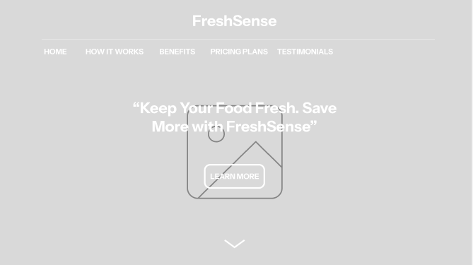 

*Figura 2.* Como funciona FreshSense
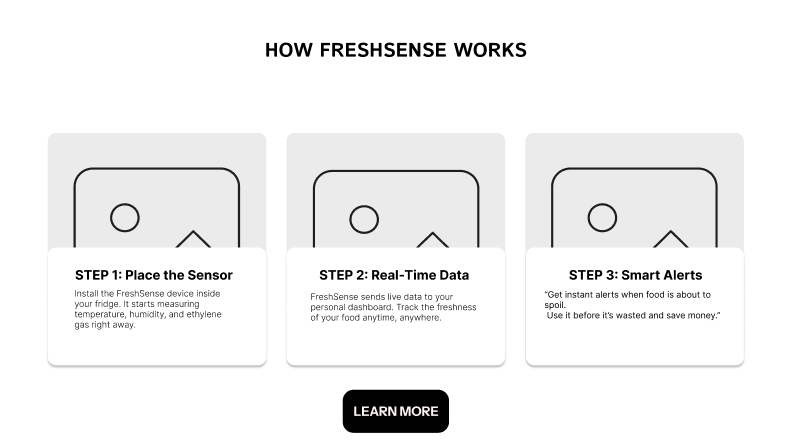 

*Figura 3.* Vistazo inicial a los beneficios 
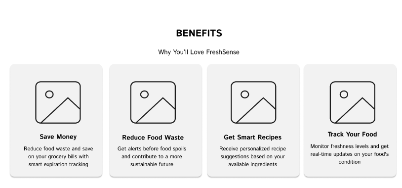 

*Figura 4.* Modelo inicial para los planes de subscripción.
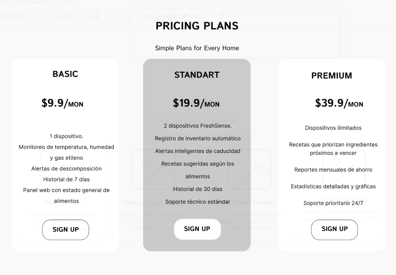 

*Figura 5.* Wireframe para los testimonios
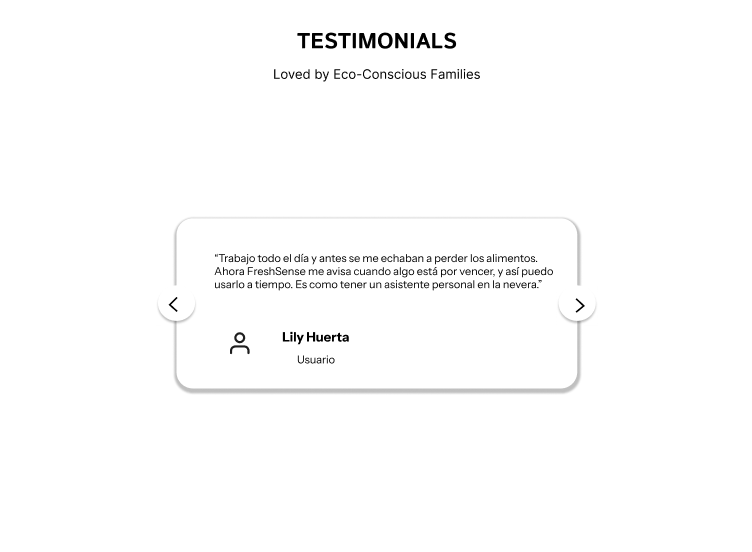 

*Figura 6.* Wireframe para el formulario y se incluye el footer
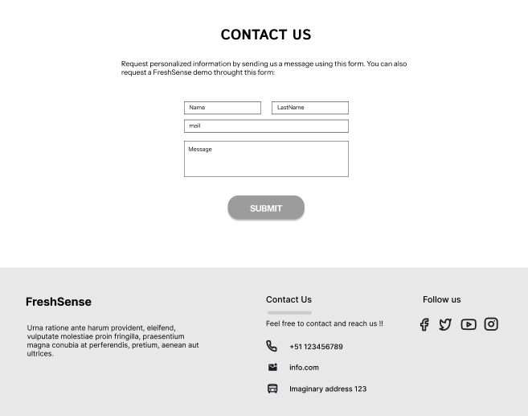 


### 4.3.2. Landing Page Mock-up

Una vez se realizaron los wireframes, usamos los Style Guidelines, para desarrollar el siguiente paso, los mock ups, utilizamos los colores y modelos referidos en los guidelines, los colores verdes y azules predominantes en el diseño, aluden a la escencia de la aplicación:

*Figura 7.* Mock-Up de la página principal 
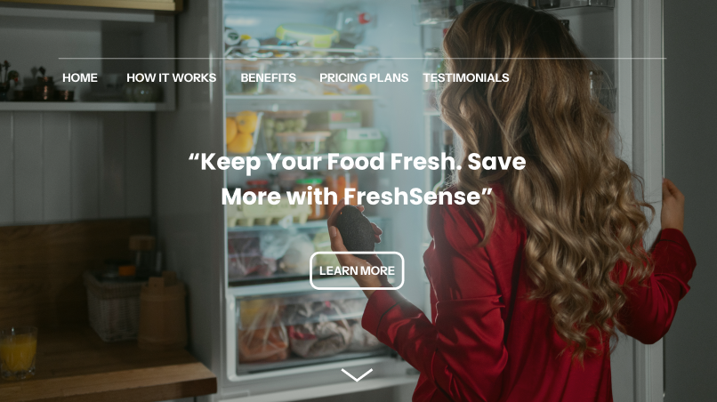 

*Figura 8.* Mock-Up se muestra las funciones de FreshSense
 

*Figura 9.* Vistazo inicial a los beneficios 
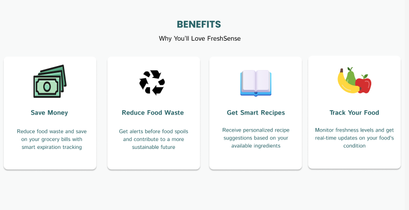 

*Figura 10.* Mock-Up para los planes de subscripción.
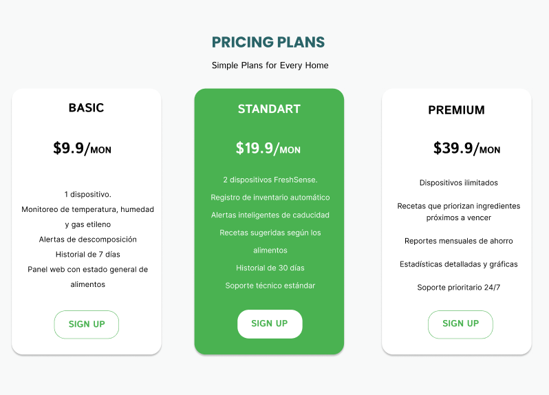 

*Figura 11.* Mock-Up para los testimonios
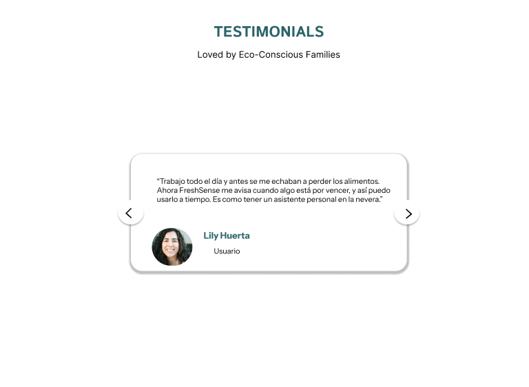 

*Figura 12.* Mock-Up para el formulario y se incluye el footer
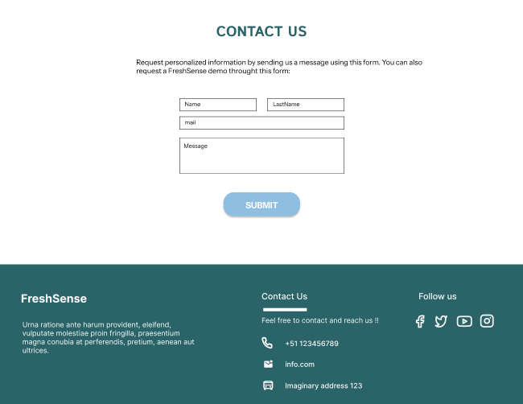 

## 4.4. Web Applications UX/UI Design
### 4.4.1. Web Applications Wireframes
### 4.4.2. Web Applications Wireflow Diagrams

Para este apartado, el wireflow se diseñó para representar de forma detallada el proceso de uso desde el inicio de sesión hasta las funcionalidades principales, como la gestión del inventario de alimentos, el monitoreo en tiempo real, la recepción de alertas, la consulta de recetas, el seguimiento de logros y la personalización de ajustes. De esta manera, se asegura que la navegación sea coherente, intuitiva y centrada en mejorar la experiencia del usuario final.

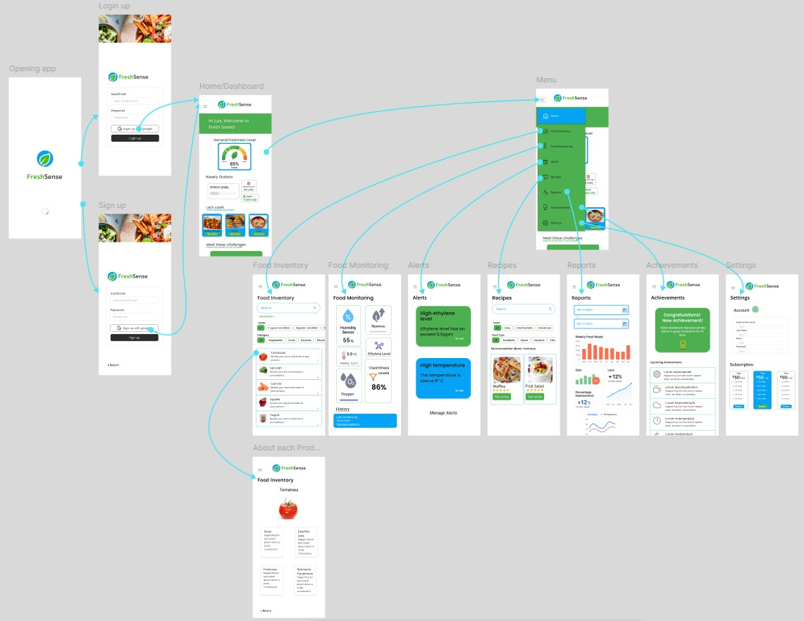

### 4.4.3. Web Applications Mock-ups
### 4.4.4. Web Applications User Flow Diagrams
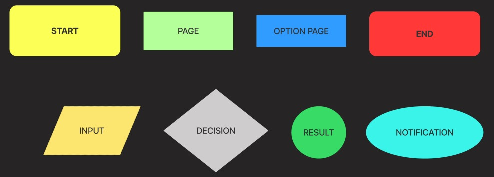

Cada figura del diagrama tiene un significado específico dentro del flujo de usuario:

- Start: punto de inicio del recorrido.

- Page: pantalla normal de la aplicación.

- Option Page: menú o sección con varias opciones.

- End: final del flujo o salida de la app.

- Input: ingreso de datos por parte del usuario.

- Decision: condición que define diferentes caminos.

- Result: acción realizada con éxito.

- Notification: mensaje o alerta mostrado al usuario.


Ahora representamos los User Flow Diagrams de la aplicación web FreshSense, los cuales permiten visualizar de manera clara el recorrido que realiza el usuario dentro del sistema, desde que abre la aplicación hasta que cierra sesión. Este diagrama utiliza convenciones gráficas específicas para identificar los distintos tipos de pantallas, acciones, decisiones, resultados y notificaciones que intervienen en la experiencia del usuario. Gracias a esta representación, se facilita el análisis de la interacción, la detección de posibles mejoras en la navegación y la validación de que todos los escenarios de uso estén contemplados.

## 4.5. Web Applications Prototyping

Link al prototip: https://www.figma.com/proto/WMu6m6D3rPs3AI4HYKKbNJ/WireFrames-LandingPage?node-id=159-1605&p=f&t=tnVLge8rsFfHhU1S-1&scaling=min-zoom&content-scaling=fixed&page-id=159%3A1603

## 4.6. Domain-Driven Software Architecture
### 4.6. Design-Level EventStorming


### 4.6.1. Software Architecture Context Diagram
### 4.6.2. Software Architecture Container Diagrams
### 4.6.3. Software Architecture Components Diagrams
## 4.7. Software Object-Oriented Design
### 4.7.1. Class Diagrams

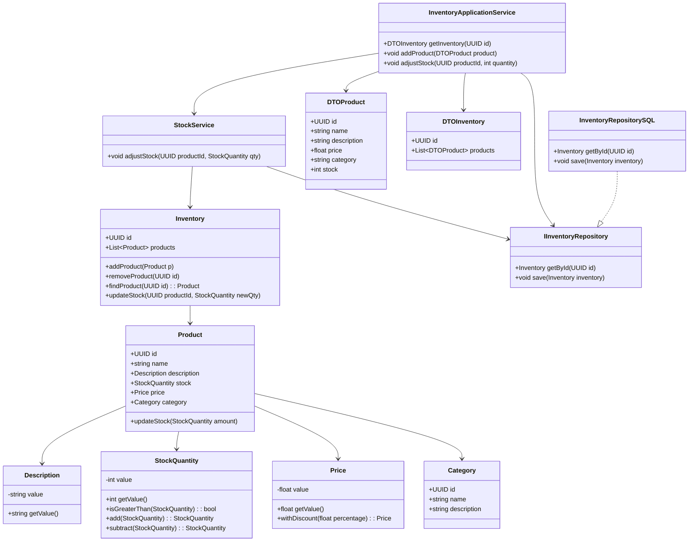
```mermaid
classDiagram
  class Product {
      +UUID id
      +string name
      +Description description
      +StockQuantity stock
      +Price price
      +Category category
      +updateStock(StockQuantity amount)
  }

  class Category {
      +UUID id
      +string name
      +string description
  }

  class Description {
      -string value
      +string getValue()
  }

  class StockQuantity {
      -int value
      +int getValue()
      +isGreaterThan(StockQuantity): bool
      +add(StockQuantity): StockQuantity
      +subtract(StockQuantity): StockQuantity
  }

  class Price {
      -float value
      +float getValue()
      +withDiscount(float percentage): Price
  }

  class Inventory {
      +UUID id
      +List~Product~ products
      +addProduct(Product p)
      +removeProduct(UUID id)
      +findProduct(UUID id): Product
      +updateStock(UUID productId, StockQuantity newQty)
  }

  class IInventoryRepository {
      +Inventory getById(UUID id)
      +void save(Inventory inventory)
  }

  class StockService {
      +void adjustStock(UUID productId, StockQuantity qty)
  }

  class InventoryApplicationService {
      +DTOInventory getInventory(UUID id)
      +void addProduct(DTOProduct product)
      +void adjustStock(UUID productId, int quantity)
  }

  class DTOProduct {
      +UUID id
      +string name
      +string description
      +float price
      +string category
      +int stock
  }

  class DTOInventory {
      +UUID id
      +List~DTOProduct~ products
  }

  class InventoryRepositorySQL {
      +Inventory getById(UUID id)
      +void save(Inventory inventory)
  }

  Product --> Description
  Product --> StockQuantity
  Product --> Price
  Product --> Category
  Inventory --> Product
  StockService --> Inventory
  StockService --> IInventoryRepository

  InventoryApplicationService --> StockService
  InventoryApplicationService --> IInventoryRepository
  InventoryApplicationService --> DTOProduct
  InventoryApplicationService --> DTOInventory

  InventoryRepositorySQL ..|> IInventoryRepository

```
### 4.7.2. Class Dictionary
| **Class**                       | **Definition**                                                                                        |
| ------------------------------- | ----------------------------------------------------------------------------------------------------- |
| **Product**                     | Entity that represents a product, with details such as name, description, stock, price, and category. |
| **Category**                    | Entity that groups products under a specific name and description.                                    |
| **Description**                 | Value Object that encapsulates the textual description of a product.                                  |
| **StockQuantity**               | Value Object that manages the stock quantity of a product and its operations.                         |
| **Price**                       | Value Object that represents the price of a product and allows discounts to be applied.               |
| **Inventory**                   | Aggregate that manages a collection of products, allowing adding, removing, and updating their stock. |
| **IInventoryRepository**        | Interface that defines persistence operations for the Inventory.                                      |
| **StockService**                | Domain service that adjusts the stock of products within the Inventory.                               |
| **InventoryApplicationService** | Application service that orchestrates high-level operations over the Inventory.                       |
| **DTOProduct**                  | Data Transfer Object that represents the structure of a product in the application layer.             |
| **DTOInventory**                | Data Transfer Object that represents a complete Inventory in the application layer.                   |
| **InventoryRepositorySQL**      | Concrete implementation of the repository using SQL to persist the Inventory.                         |

## 4.8. Database Design
### 4.8.1. Database Diagram

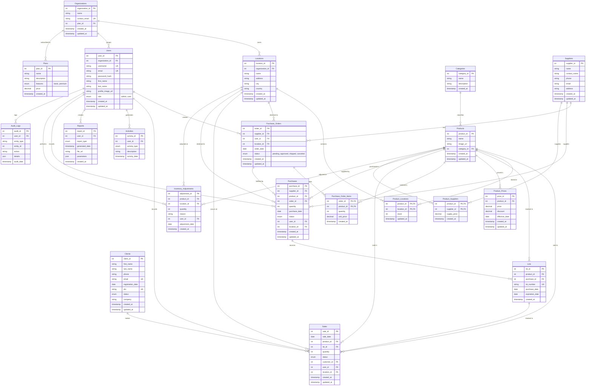
```mermaid
erDiagram
  Organizations ||--o{ Locations : "owns"
  Organizations ||--o{ Users : "groups"
  Organizations ||--o{ Plans : "subscribed to"
  Clients ||--o{ Sales : "makes"
  Products ||--o{ Sales : "sold in"
  Products ||--o{ Product_Locations : "stored in"
  Locations ||--o{ Product_Locations : "contains"
  Categories ||--o{ Products : "classifies"
  Products ||--o{ Lots : "tracked in"
  Purchases ||--o{ Lots : "sources"
  Products ||--o{ Product_Prices : "priced in"
  Suppliers ||--o{ Purchase_Orders : "receives"
  Users ||--o{ Purchase_Orders : "creates"
  Locations ||--o{ Purchase_Orders : "destined to"
  Purchase_Orders ||--o{ Purchase_Order_Items : "includes"
  Products ||--o{ Purchase_Order_Items : "ordered in"
  Products ||--o{ Sales : "sold in"
  Lots ||--o{ Sales : "tracked in"
  Users ||--o{ Sales : "records"
  Locations ||--o{ Sales : "occurs at"
  Users ||--o{ Activities : "generates"
  Users ||--o{ Reports : "creates"
  Suppliers ||--o{ Purchases : "supplies"
  Products ||--o{ Purchases : "purchased in"
  Purchase_Orders ||--o{ Purchases : "fulfilled by"
  Users ||--o{ Purchases : "records"
  Locations ||--o{ Purchases : "destined to"
  Products ||--o{ Product_Suppliers : "supplied by"
  Suppliers ||--o{ Product_Suppliers : "supplies"
  Products ||--o{ Inventory_Adjustments : "adjusted in"
  Locations ||--o{ Inventory_Adjustments : "adjusted at"
  Users ||--o{ Inventory_Adjustments : "performs"
  Users ||--o{ Audit_Logs : "logs"

  Organizations {
      int organization_id PK
      string name
      string contact_email UK
      int plan_id FK
      timestamp created_at
      timestamp updated_at
  }

  Plans {
      int plan_id PK
      string name
      string description
      enum features "basic, premium"
      decimal price
      timestamp created_at
  }

  Clients {
      int client_id PK
      string first_name
      string last_name
      string phone
      string email UK
      date registration_date
      string dni UK
      enum status
      string company
      timestamp created_at
      timestamp updated_at
  }

  Products {
      int product_id PK
      string name
      string image_url
      int category_id FK
      timestamp created_at
      timestamp updated_at
  }

  Locations {
      int location_id PK
      int organization_id FK
      string name
      string address
      string city
      string country
      timestamp created_at
      timestamp updated_at
  }

  Product_Locations {
      int product_id PK,FK
      int location_id PK,FK
      int stock
      timestamp updated_at
  }

  Categories {
      int category_id PK
      string name
      string description
      timestamp created_at
  }

  Lots {
      int lot_id PK
      int product_id FK
      int purchase_id FK
      string lot_number UK
      date purchase_date
      date expiration_date
      timestamp created_at
  }

  Product_Prices {
      int price_id PK
      int product_id FK
      decimal price
      decimal discount
      date effective_date
      timestamp created_at
      timestamp updated_at
  }

  Purchase_Orders {
      int order_id PK
      int supplier_id FK
      int user_id FK
      int location_id FK
      date order_date
      enum status "pending, approved, shipped, canceled"
      timestamp created_at
      timestamp updated_at
  }

  Purchase_Order_Items {
      int order_id PK,FK
      int product_id PK,FK
      int quantity
      decimal unit_price
      timestamp created_at
  }

  Sales {
      int sale_id PK
      date sale_date
      int product_id FK
      int lot_id FK
      int quantity
      enum status
      int customer_id FK
      int user_id FK
      int location_id FK
      timestamp created_at
      timestamp updated_at
  }

  Users {
      int user_id PK
      int organization_id FK
      string username UK
      string email UK
      string password_hash
      string first_name
      string last_name
      string profile_image_url
      enum role "admin, user"
      timestamp created_at
      timestamp updated_at
  }

  Activities {
      int activity_id PK
      int user_id FK
      enum activity_type
      string description
      timestamp activity_date
  }

  Reports {
      int report_id PK
      int user_id FK
      enum report_type
      timestamp generated_date
      string file_url
      json parameters
      timestamp created_at
  }

  Suppliers {
      int supplier_id PK
      string name
      string contact_name
      string phone
      string email
      string address
      timestamp created_at
      timestamp updated_at
  }

  Product_Suppliers {
      int product_id PK,FK
      int supplier_id PK,FK
      decimal supply_price
      timestamp created_at
  }

  Purchases {
      int purchase_id PK
      int supplier_id FK
      int product_id FK
      int order_id FK
      int quantity
      date purchase_date
      enum status
      int user_id FK
      int location_id FK
      timestamp created_at
      timestamp updated_at
  }

  Inventory_Adjustments {
      int adjustment_id PK
      int product_id FK
      int location_id FK
      int quantity
      string reason
      int user_id FK
      date adjustment_date
      timestamp created_at
  }

  Audit_Logs {
      int audit_id PK
      int user_id FK
      string entity_type
      int entity_id
      string action
      json details
      timestamp audit_date
  }
```

# Capítulo V: Product Implementation, Validation & Deployment
## 5.1. Software Configuration Management

En esta sección se detalla cómo se implementa, organiza y publica **FreshSense** en su estado actual (Landing estática con **HTML, CSS y JavaScript**). No se utiliza aún backend ni base de datos; la publicación se realiza con **GitHub Pages**. El objetivo es mantener la consistencia del desarrollo y dejar preparado el terreno para futuras iteraciones.

---

### 5.1.1. Software Development Environment Configuration  
**Implementado (estado actual):**

- **Frontend (Landing):** HTML5, CSS3, JavaScript (vanilla).  
- **Responsive Web Design:** únicamente con CSS (Flexbox/Grid).  
- **Editor recomendado:** Visual Studio Code.  
- **Control de versiones y colaboración:** Git + GitHub.  
- **Gestión de tareas:** Trello (board de sprints).  

**Estructura de archivos (referencial):**
```
Landing-page-FreshSense/
├─ index.html
├─ css/
│ └─ styles.css
├─ js/
│ └─ main.js
├─ assets/
│ ├─ img/
│ └─ ...
└─ i18n/
└─ translate.js
```

> Nota: En esta entrega no se ha implementado servidor, API ni base de datos.

---

### 5.1.2. Source Code Management  

**Repositorio GitHub (actual):**  
`https://github.com/1ASI0729-2520-7357-G4-SenseEat/Landing-page-FreshSense`

**Flujo de trabajo (GitFlow ligero):**

- **Ramas principales**
  - `main`: versión estable publicada.  
  - `develop`: integración previa a publicación.  

- **Ramas de apoyo**
  - `feature/*`: nuevas secciones o mejoras.  
    Ejemplo: `feature/sprint1-[nombre]`

**Conventional Commits (ejemplos):**
```
feat: agregar sección de planes con cards responsivas
fix(navbar): corregir overflow en versión móvil
docs(readme): actualizar pasos de despliegue en GitHub Pages
```

---

### 5.1.3. Source Code Style Guide & Conventions  

**HTML**
- Uso de etiquetas semánticas: `<header>`, `<nav>`, `<main>`, `<section>`, `<footer>`.  
- Imágenes con atributo `alt`.  
- Enlaces relativos y consistentes entre páginas.  
- Scripts al final del `body` cuando corresponda.  

**CSS**
- Variables CSS en `:root` (`--color-primario`, `--spacing`, etc.).  
- Convención de clases en *kebab-case* (`.hero-title`, `.card-grid`).  
- Layout con Flexbox y/o Grid.  
- Media queries para puntos de quiebre (`960px`, `760px`, `560px`).  
- Accesibilidad: estados `:hover`, `:focus-visible`, contraste adecuado.  

**JavaScript (vanilla)**
- Uso de `const` / `let` (evitar `var`).  
- Funciones pequeñas y claras.  
- Separar lógica del DOM cuando sea posible.  
- Uso moderado de `localStorage` (solo para idioma o preferencias del cliente).  

---

### 5.1.4. Software Deployment Configuration  

**Despliegue actual — GitHub Pages (Landing estática):**

**Pasos:**
1. Subir el código al repositorio `Landing-page-FreshSense` en la rama `main`.  
2. En GitHub: ir a **Settings → Pages**.  
3. En **Build and deployment**, seleccionar **Deploy from a branch**.  
4. Elegir **Branch:** `main` y **Folder:** `/ (root)`. Guardar.  
5. Esperar a que GitHub procese el sitio y obtener la URL pública.  

**Landing Page FreshSense:**  
[https://1asi0729-2520-7357-g4-senseeat.github.io/Landing-page-FreshSense/](https://1asi0729-2520-7357-g4-senseeat.github.io/Landing-page-FreshSense/)

**Validación post-despliegue:**
- Navegación entre páginas y secciones (`index.html`, beneficios, planes, contacto, etc.).  
- Verificación de rutas relativas a hojas de estilo, imágenes y scripts.  
- Pruebas responsive en móvil y escritorio.  
- Revisión de accesibilidad básica (focus, contraste, alt text).  

## 5.2. Landing Page, Services & Applications Implementation
### 5.2.1. Sprint 1

#### 5.2.1.1. Sprint Planning 1

En esta sección se especifican los aspectos principales del Sprint Planning Meeting. La estructura a utilizar se presenta a continuación.

| Campo                               | Detalle                                                                                |
| ----------------------------------- | -------------------------------------------------------------------------------------- |
| **Date**                            | 2025-09-09                                                                             |
| **Time**                            | 10:00 AM                                                                               |
| **Location**                        | Sala virtual – Google Meet                                                             |
| **Prepared By**                     |  Vega Coronado, Fabricio Samir                                                         |
| **Attendees (to planning meeting)** | Romina Tuesta Marin / Vega Coronado, Fabricio Samir  / Villanueva Andrade, Ysaac Ligorio / Tumi Oliden, Manuel Ignacio / Valverde Portuguez, Natalia Ximena |
| **Sprint 1 – 1 Review Summary** | Este es el primer sprint, por lo que no hay resultados anteriores a revisar. El equipo está iniciando el desarrollo de la landing page de FreshSense.|
| **Sprint 1 – 1 Retrospective Summary** | No aplica, al ser el primer sprint. Se acordó establecer prácticas de comunicación diaria y seguimiento mediante Trello y reuniones cortas cada mañana.|

| Campo                   | Detalle                                                                                                                                                                        |
| ----------------------- | ------------------------------------------------------------------------------------------------------------------------------------------------------------------------------ |
| **Sprint 1 Goal**       | Nuestro enfoque está en entregar una versión inicial de la landing page de FreshSense que muestre su propuesta de valor y beneficios principales. Creemos que esto generará claridad y confianza en los usuarios potenciales (jóvenes adultos y pequeños emprendedores de alimentos). Esto se confirmará cuando los visitantes puedan navegar la página, entender la solución y enviar un formulario de contacto. |
| **Sprint 1 Velocity**   | 26 Story Points (capacidad estimada para este sprint inicial)                                                                                                                  |
| **Sum of Story Points** | 26 Story Points                                                                                                                                                                |

**User Stories incluidas:**

HU01: Header con logo y nombre de FreshSense (2 SP)

HU02: Descripción breve de la plataforma (3 SP)

HU03: Sección de beneficios (5 SP)

HU04: Formulario de contacto (8 SP)

HU05: Diseño responsive (8 SP)


#### 5.2.1.2. Aspect Leaders and Collaborators


| Team Member (Last Name, First Name)   | Github Username        | wireframes y MockUps landing |  Visualización beneficios y características | Consultar planes y precios | Formulario de contacto | Sección de testimonios | Despliegue de servicio | Cambio de idioma |
|-----------|----------------------|-----------|----------------------|-----------|----------------------|-----------|-----------|-----------|
| Valverde Portuguez Natalia Ximena |        |    (L)   |     (C)     |    (C)      |   (L)   |     (C)     |    (C)      |   (C)      |
|  Romina Alejanda Tuesta Marin    |     Romimi1     |    (L)   |     (C)     |    (L)      |   (L)   |     (C)     |    (L)      |   (C)      |
|  Tumi Oliden Manuel Ignacio      |     |      (C)   |     (C)     |    (C)      |   (L)   |     (C)     |    (C)      |   (C)      |
|  Vega Coronado Fabricio Samir    |     |      (C)   |     (C)     |    (C)      |   (C)   |     (L)     |    (C)      |   (C)      |
|  Villanueva Andrade Ysaac Ligorio |     |      (C)   |     (C)     |    (C)      |   (L)   |     (C)     |    (C)      |   (L)      |

#### 5.2.1.3. Sprint Backlog 1
En este sprint se desarrollará y desplegará la Landing Page de EcoTrack, que servirá como punto de presentación del producto. Se crearán las secciones informativas clave (propuesta de valor, explicación del producto, beneficios, planes y precios, formulario de contacto y testimonios), estableciendo así las bases visuales y funcionales del proyecto.

Herramienta de control: Trello
<br>
URL del Board: https://trello.com/b/ScNLfxb4/sprint1-freshsense

| User Story |                                | Work-Item / Task |                                 |                                                                           |                        |                     |                                                    |
| ---------- | ------------------------------ | ---------------- | ------------------------------- | ------------------------------------------------------------------------- | ---------------------- | ------------------- | -------------------------------------------------- |
| **Id**     | **Title**                      | **Id**           | **Title**                       | **Description**                                                           | **Estimation (Hours)** | **Assigned To**     | **Status** (To-do / In-Process / To-Review / Done) |
| US01       | Visualización propuesta        | T01              | Diseño del mensaje principal    | Redactar y diseñar mensaje principal y valor de la solución               | 3                      | Romina    | Done                                               |
|            |                                | T02              | Desarrollo del encabezado       | Implementar sección superior con mensaje y valor destacado                | 4                      |   Manuel     | In-Process                                         |
| US02       | Sección para pequeños negocios | T03              | Contenido de beneficios         | Redactar y diseñar beneficios específicos para emprendedores              | 3                      | Romina | To-Review                                          |
|            |                                | T04              | Desarrollo de sección           | Implementar sección con beneficios específicos para el perfil emprendedor | 4                      | Natalia    | To-do                                              |
| US03       | Formulario de contacto         | T05              | Diseño del formulario           | Diseñar formulario simple con campos mínimos requeridos                   | 2                      | Romina    | Done                                               |                                     
| US04       | CTA para suscripción           | T07              | Diseño del botón CTA            | Diseñar botón llamativo para suscripción o prueba                         | 2                      | Fabricio   | Done                                               |
|            |                                | T08              | Implementación del botón        | Añadir botón funcional que redirija a formulario o registro de prueba     | 3                      | Fabricio    | To-do                                              |
| US05       | Compatibilidad móvil           | T09              | Adaptación responsive           | Configurar CSS responsive para toda la landing page                       | 5                      | Ysaac      | In-Process                                         |
|            |                                | T10              | Pruebas en dispositivos móviles | Realizar pruebas de compatibilidad en distintos tamaños de pantalla       | 3                      | Natalia    | To-do                                              |

#### 5.2.1.4. Development Evidence for Sprint Review

En esta sección se presentan los avances en la implementación de la solución FreshSense, considerando los productos contemplados en el alcance del Sprint: Landing Page. Durante este periodo se trabajó principalmente en el desarrollo de la Landing Page, incorporando mejoras visuales, de usabilidad y funcionalidad. Entre los principales avances se encuentran la creación de la página principal, la integración de estilos y animaciones, la optimización del comportamiento de la navegación y la incorporación de nuevas funciones interactivas.

A continuación, se detallan los commits realizados en los repositorios vinculados a la implementación:

| Repository |   Branch    | Commit Id |  Commit Message  |   Commit Message Body    |   Commited on (Date)  |        
| ---------- | ----------- | --------- | ---------------- | ------------------------ | --------------------- | 
| Romini1/github.com/1ASI0729-2520-7357-G4-SenseEat/Landing-page-FreshSense/tree/develop | develop     |   d201420  |    chore: upload initial landingpage    |  Se creó el archivo index.html, css y main.js como la página principal de la landing, estructurando la base inicial del proyecto.                        |    18/09/25     | 
| YsaacVillanueva/github.com/1ASI0729-2520-7357-G4-SenseEat/Landing-page-FreshSense/tree/develop | develop     |  e44f923  |    feat: add translate.js        | Se creó la funcionalidad dinámica del cambio de idioma en la landing                         |    19/09/25     | 
| ManuelTumi2224/github.com/1ASI0729-2520-7357-G4-SenseEat/Landing-page-FreshSense/tree/develop  | develop     |  c5cfc27   |  feat: Updated Footer and Plans |  Se actualizó la sección planes y subscripciones            |   19/09/25       | 
| YsaacVillanueva/github.com/1ASI0729-2520-7357-G4-SenseEat/Landing-page-FreshSense/tree/develop | develop     |  827e63c |    Merge pull request #1 from 1ASI0729-2520-7357-G4-SenseEat/feature/sprint1-Ysaac         |   Se hizo un merge y pull request opara las secciones actualizadas en todos los archivos         |     19/09/25    | 


#### 5.2.1.5. Execution Evidence for Sprint Review


Durante este Sprint se avanzó de manera significativa en el desarrollo de la Landing Page del proyecto FreshSense, la cual constituye el primer punto de contacto con los usuarios. Se implementó la estructura base con la página principal, se integraron estilos y animaciones, y se añadieron funcionalidades interactivas como el slider y un scroll más fluido. Asimismo, se realizaron correcciones en la navegación para garantizar una experiencia más clara e intuitiva, además se implementó exitosamente la funcionalidad del cambio de idioma, de español a ingles.

Con estos avances, se ha logrado contar con una primera versión navegable de la landing page, lo que permite mostrar la propuesta de valor de FreshSense y establecer la base para siguientes mejoras visuales y técnicas.

<br>

*Figura 1.* Página principal con navbar y sección de bienvenida.

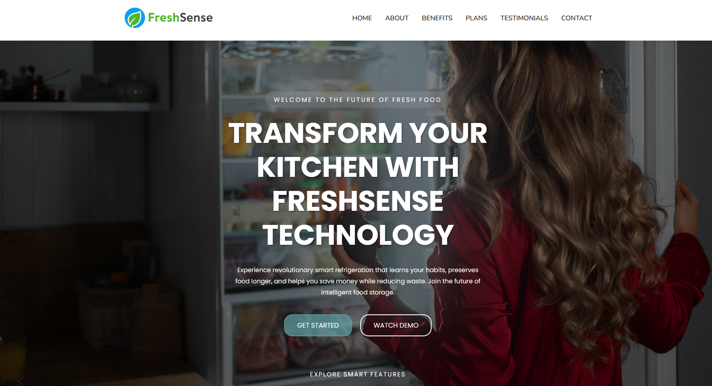 


*Figura 2.* Sección acerca de FreshSense.

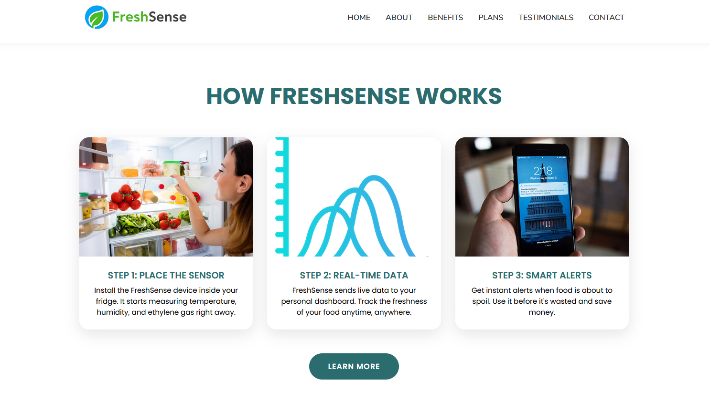 


*Figura 3.* Sección acerca de beneficios.

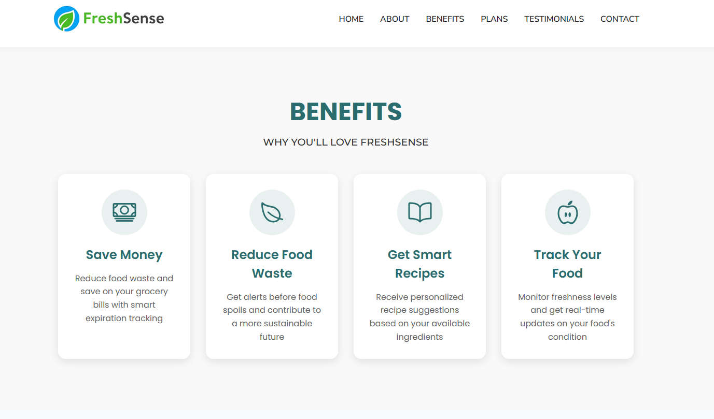 


*Figura 4.* Sección de planes de subscripción.

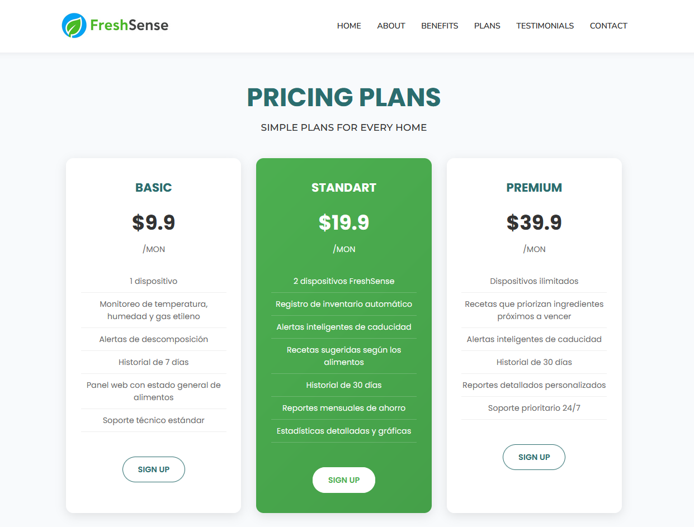 


*Figura 5.* Sección de testimonios.

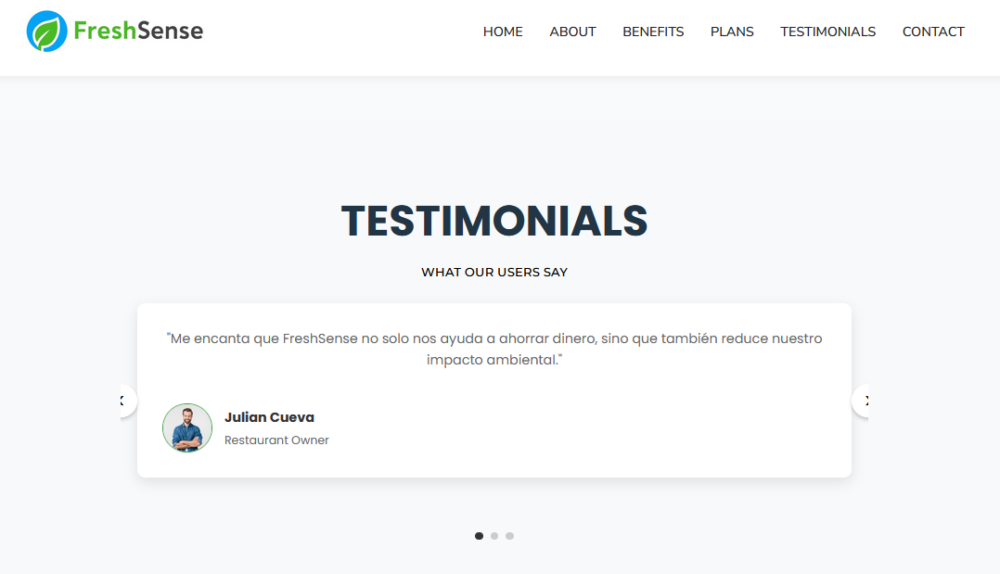 


*Figura 6.* Sección de formulario de contacto.

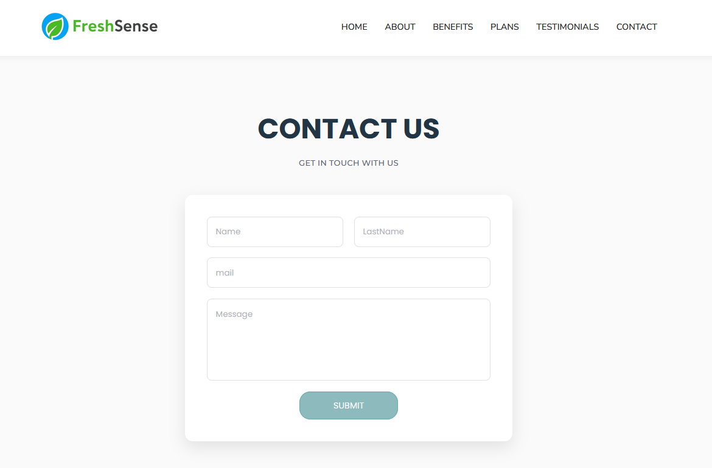 

#### Video demostrativo

Se preparó un video donde se ilustra la navegación en la landing page y se explican las funcionalidades desarrolladas en este Sprint:
 

(en caso de que el link no funciones: https://upcedupe-my.sharepoint.com/:v:/g/personal/u202211706_upc_edu_pe/EbiyfxOB6e9FteIuNTOmoioBHUcBXfgY5-pCSjEH9UJx-g?nav=eyJyZWZlcnJhbEluZm8iOnsicmVmZXJyYWxBcHAiOiJPbmVEcml2ZUZvckJ1c2luZXNzIiwicmVmZXJyYWxBcHBQbGF0Zm9ybSI6IldlYiIsInJlZmVycmFsTW9kZSI6InZpZXciLCJyZWZlcnJhbFZpZXciOiJNeUZpbGVzTGlua0NvcHkifX0&e=njAFe7)

#### 5.2.1.6. Services Documentation Evidence for Sprint Review

En este Sprint, el trabajo realizado se centró en el desarrollo de la Landing Page de FreshSense, implementada únicamente con HTML, CSS y JavaScript. Dado que se trata de una página estática cuyo alcance se limita a la presentación de información y a la interacción en el lado del cliente, no se definieron ni consumieron Web Services.

En consecuencia, durante este Sprint no corresponde la elaboración de documentación con OpenAPI (Swagger), ya que esta herramienta se utiliza exclusivamente para describir y documentar APIs REST que exponen endpoints de un backend. La integración con Web Services y su respectiva documentación será abordada en Sprints posteriores, cuando la solución incluya funcionalidades dinámicas que requieran intercambio de datos entre frontend y backend.

#### 5.2.1.7. Software Deployment Evidence for Sprint Review

Durante este Sprint se avanzó en los procesos de Deployment relacionados con la solución EcoTrack, con el objetivo de asegurar la disponibilidad de los productos desarrollados para su validación y demostración. Dentro de este Sprint, el esfuerzo principal estuvo orientado al despliegue de la Landing Page, que fue implementada con HTML, CSS y JavaScript.

El despliegue se realizó utilizando GitHub Pages, lo que permitió contar con un entorno accesible de manera pública sin necesidad de un proveedor de cloud externo. Esta estrategia fue seleccionada por su facilidad de integración con los repositorios de GitHub y por brindar un proceso automatizado de publicación a partir de la rama develop del proyecto.

Acciones realizadas en el proceso de Deployment

1. Creación y configuración del repositorio en GitHub.
Se configuró el repositorio ecotrack-landingpage en la cuenta de GitHub del equipo.

2. Configuración de GitHub Pages.

- Se habilitó la opción de GitHub Pages en la sección de Settings.

- Se seleccionó la rama develop como fuente de publicación.

- Se configuró la carpeta raíz del proyecto como directorio base de la publicación.

3. Automatización de despliegue.
Gracias a la integración nativa de GitHub Pages, cada nuevo commit realizado en la rama develop se despliega automáticamente en la URL pública asignada.

4. Validación del despliegue.
Se realizó la verificación de la publicación, comprobando que la landing page se visualiza correctamente en la dirección generada por GitHub Pages.

#### Evidencia del Deployment

*Figura 1.* Configuración de GitHub Pages en el repositorio de la landing page.

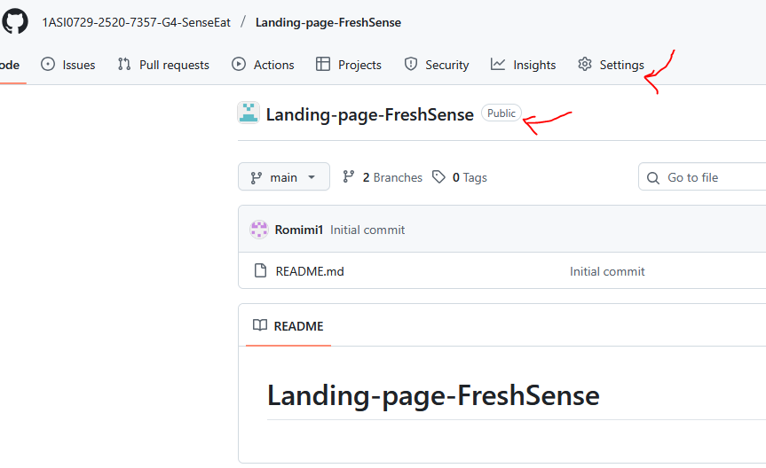 


*Figura 2.* Se ingresó a setting y luego a pages.

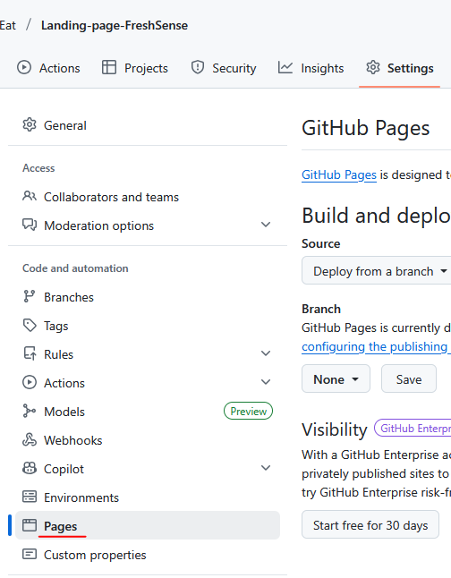 

*Figura 3.* seleccionamos la rama en la que se encuentre alojado el proyecto.

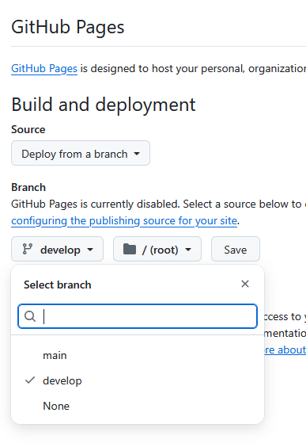 


*Figura 4.* Esperamos la URL autogenerada por githubpages.

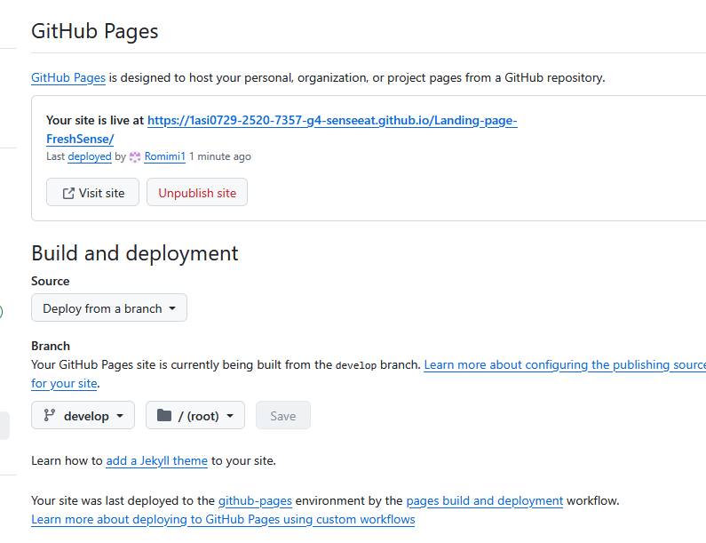 


#### Link a continuación: 

https://1asi0729-2520-7357-g4-senseeat.github.io/Landing-page-FreshSense/

#### 5.2.1.8. Team Collaboration Insights during Sprint  

La colaboración del equipo se evidenció en la distribución equitativa de tareas y en la constante comunicación a través de reuniones y canales digitales.

Se trabajó con GitHub para la gestión de ramas y pull requests, lo cual permitió mantener la trazabilidad del proyecto y asegurar revisiones por pares antes de integrar código.

Asimismo, se promovió un ambiente de retroalimentación positiva que facilitó la resolución de problemas técnicos.

El nivel de compromiso y coordinación alcanzado fue fundamental para cumplir con los objetivos planteados en este Sprint.

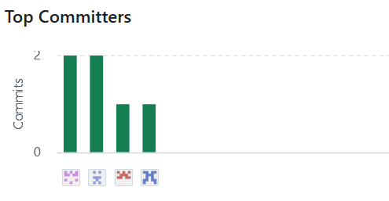 

En la imagen se puede ser a 4 colaboradores, primero, con más commits se encuentra Romina, después se encuentra manuel con la misma cantidad de commits, luego Ysaac y finalmente Fabricio.


# Conclusiones

- El desarrollo del proyecto **FreshSense**, producto de la startup *SenseEat*, permitió aplicar de manera integral los conocimientos adquiridos para el landing page en el curso de **Desarrollo de Aplicaciones Open Source**. 

- A través de la identificación de problemas relacionados con el desperdicio de alimentos y la necesidad de una gestión eficiente de la frescura, se diseñó una solución tecnológica basada en sensores inteligentes con una paginas web para su control.  

- Durante el proceso se implementaron metodologías ágiles que facilitaron la organización del equipo y la priorización de tareas.

- El trabajo en equipo fue esencial para cumplir los objetivos planteados. La colaboración mediante GitHub, las revisiones cruzadas de código y la comunicación constante aseguraron la calidad del producto. Además, se generó documentación técnica y de servicios que facilitará la continuidad del proyecto en futuros ciclos de desarrollo.  

- **FreshSense representa un avance hacia soluciones innovadoras para el sector alimentario**, alineadas con los Objetivos de Desarrollo Sostenible (ODS), contribuyendo a la reducción del desperdicio y promoviendo un consumo más responsable mediante la tecnología.

# Bibliografía

- Beck, K., & Fowler, M. (2000). *Planning Extreme Programming*. Addison-Wesley.  
- Cockburn, A. (2002). *Agile Software Development*. Addison-Wesley.  
- Evans, E. (2004). *Domain-Driven Design: Tackling Complexity in the Heart of Software*. Addison-Wesley.  
- Fowler, M. (2003). *Patterns of Enterprise Application Architecture*. Addison-Wesley.  
- Sommerville, I. (2011). *Software Engineering* (9th ed.). Addison-Wesley.
- Organización de las Naciones Unidas. (2015). *Objetivos de Desarrollo Sostenible*. Disponible en: [https://www.un.org/sustainabledevelopment/es/](https://www.un.org/sustainabledevelopment/es/)

# Anexos

