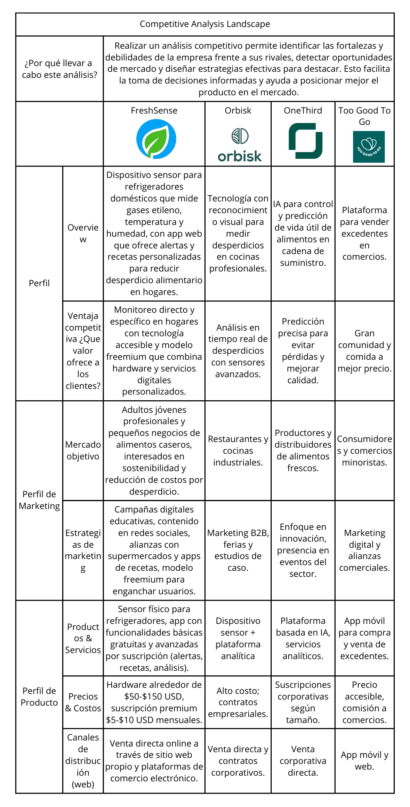

# report
# FreshSense

<h3>Universidad Peruana de Ciencias Aplicadas</h3>

 

<strong>Ingeniería de Software - 2025-2</strong> 
<strong>1ASI0729 - Desarrollo de Aplicaciones Open Source</strong> 
<strong>NRC: 7357 
<strong>Profesor: Rafael Oswaldo Castro Veramendi</strong> 

 <strong>Informe del Trabajo Final</strong>  

<strong>Startup: SenseEat</strong> 
<strong>Producto: FreshSense</strong> 

### Team Members:

|             Member              |   Code    |
|:-------------------------------:|:---------:|
|  Valverde Portuguez Natalia Ximena | u20231a816 |
|  Tumi Oliden Manuel Ignacio  |    u20241c134    |
|  Vega Coronado Fabricio Samir  |    u202317000    |
|  Villanueva Andrade Ysaac Ligorio   |    u20231c168    |
|  Tuesta Marin Romina Alejandra  |    U202211706   |

<strong> Setiembre 2025</strong> 

# Registro de Versiones del Informe

| Versión | Fecha      | Autor        | Descripción de modificación                   |
|---------|------------|--------------|-----------------------------------------------|
| 1.0     | 05/09/2025 | Romina Tuesta | Creación de la estructura inicial del reporte |
|         |            |              |                                               |
|         |            |              |                                               |
|         |            |              |                                               |
|         |            |              |                                               |
|         |            |              |                                               |

# Project Report Collaboration Insights

---

## Contenido
- [Student Outcome](#student-outcome)
- [Capítulo I: Introducción](#capítulo-i-introducción)
    - [1.1. Startup Profile](#11-startup-profile)
        - [1.1.1. Descripción de la Startup](#111-descripción-de-la-startup)
        - [1.1.2. Perfiles de integrantes del equipo](#112-perfiles-de-integrantes-del-equipo)
    - [1.2. Solution Profile](#12-solution-profile)
        - [1.2.1. Antecedentes y problemática](#121-antecedentes-y-problemática)
        - [1.2.2. Lean UX Process](#122-lean-ux-process)
            - [1.2.2.1. Lean UX Problem Statements](#1221-lean-ux-problem-statements)
            - [1.2.2.2. Lean UX Assumptions](#1222-lean-ux-assumptions)
            - [1.2.2.3. Lean UX Hypothesis Statements](#1223-lean-ux-hypothesis-statements)
            - [1.2.2.4. Lean UX Canvas](#1224-lean-ux-canvas)
    - [1.3. Segmentos objetivo](#13-segmentos-objetivo)
- [Capítulo II: Requirements Elicitation & Analysis](#capítulo-ii-requirements-elicitation--analysis)
    - [2.1. Competidores](#21-competidores)
        - [2.1.1. Análisis competitivo](#211-análisis-competitivo)
        - [2.1.2. Estrategias y tácticas frente a competidores](#212-estrategias-y-tácticas-frente-a-competidores)
    - [2.2. Entrevistas](#22-entrevistas)
        - [2.2.1. Diseño de entrevistas](#221-diseño-de-entrevistas)
        - [2.2.2. Registro de entrevistas](#222-registro-de-entrevistas)
        - [2.2.3. Análisis de entrevistas](#223-análisis-de-entrevistas)
    - [2.3. Needfinding](#23-needfinding)
        - [2.3.1. User Personas](#231-user-personas)
        - [2.3.2. User Task Matrix](#232-user-task-matrix)
        - [2.3.3. User Journey Mapping](#233-user-journey-mapping)
        - [2.3.4. Empathy Mapping](#234-empathy-mapping)
        - [2.3.5. As-is Scenario Mapping](#235-as-is-scenario-mapping)
    - [2.4. Ubiquitous Language](#24-ubiquitous-language)
      
- [Capítulo III: Requirements Specification](#capítulo-iii-requirements-specification)
    - [3.1. To-Be Scenario Mapping](#31-to-be-scenario-mapping)
    - [3.2. User Stories](#32-user-stories)
    - [3.3. Impact Mapping](#33-impact-mapping)
    - [3.4. Product Backlog](#34-product-backlog)
- [Capítulo IV: Product Design](#capítulo-iv-product-design)
    - [4.1. Style Guidelines](#41-style-guidelines)
        - [4.1.1. General Style Guidelines](#411-general-style-guidelines)
        - [4.1.2. Web Style Guidelines](#412-web-style-guidelines)
    - [4.2. Information Architecture](#42-information-architecture)
        - [4.2.1. Organization Systems](#421-organization-systems)
        - [4.2.2. Labeling Systems](#422-labeling-systems)
        - [4.2.3. SEO Tags and Meta Tags](#423-seo-tags-and-meta-tags)
        - [4.2.4. Searching Systems](#424-searching-systems)
        - [4.2.5. Navigation Systems](#425-navigation-systems)
    - [4.3. Landing Page UI Design](#43-landing-page-ui-design)
        - [4.3.1. Landing Page Wireframe](#431-landing-page-wireframe)
        - [4.3.2. Landing Page Mock-up](#432-landing-page-mock-up)
    - [4.4. Web Applications UX/UI Design](#44-web-applications-uxui-design)
        - [4.4.1. Web Applications Wireframes](#441-web-applications-wireframes)
        - [4.4.2. Web Applications Wireflow Diagrams](#442-web-applications-wireflow-diagrams)
        - [4.4.2. Web Applications Mock-ups](#442-web-applications-mock-ups)
        - [4.4.3. Web Applications User Flow Diagrams](#443-web-applications-user-flow-diagrams)
    - [4.5. Web Applications Prototyping](#45-web-applications-prototyping)
    - [4.6. Domain-Driven Software Architecture](#46-domain-driven-software-architecture)
        - [4.6.1. Software Architecture Context Diagram](#461-software-architecture-context-diagram)
        - [4.6.2. Software Architecture Container Diagrams](#462-software-architecture-container-diagrams)
        - [4.6.3. Software Architecture Components Diagrams](#463-software-architecture-components-diagrams)
    - [4.7. Software Object-Oriented Design](#47-software-object-oriented-design)
        - [4.7.1. Class Diagrams](#471-class-diagrams)
        - [4.7.2. Class Dictionary](#472-class-dictionary)
    - [4.8. Database Design](#48-database-design)
        - [4.8.1. Database Diagram](#481-database-diagram)
- [Capítulo V: Product Implementation, Validation & Deployment](#capítulo-v-product-implementation-validation--deployment)
    - [5.1. Software Configuration Management](#51-software-configuration-management)
        - [5.1.1. Software Development Environment Configuration](#511-software-development-environment-configuration)
        - [5.1.2. Source Code Management](#512-source-code-management)
        - [5.1.3. Source Code Style Guide & Conventions](#513-source-code-style-guide--conventions)
        - [5.1.4. Software Deployment Configuration](#514-software-deployment-configuration)
    - [5.2. Landing Page, Services & Applications Implementation](#52-landing-page-services--applications-implementation)
        - [5.2.1. Sprint 1](#521-sprint-1)
            - [5.2.1.1. Sprint Planning 1](#5211-sprint-planning-1)
            - [5.2.1.2. Aspect Leaders and Collaborators](#5212-aspect-leaders-and-collaborators)
            - [5.2.1.3. Sprint Backlog 1](#5213-sprint-backlog-1)
            - [5.2.1.4. Development Evidence for Sprint Review](#5214-development-evidence-for-sprint-review)
            - [5.2.1.5. Execution Evidence for Sprint Review](#5215-execution-evidence-for-sprint-review)
            - [5.2.1.6. Services Documentation Evidence for Sprint Review](#5216-services-documentation-evidence-for-sprint-review)
            - [5.2.1.7. Software Deployment Evidence for Sprint Review](#5217-software-deployment-evidence-for-sprint-review)
            - [5.2.1.8. Team Collaboration Insights during Sprint](#5218-team-collaboration-insights-during-sprint)

---

## Student Outcome

El curso contribuye al cumplimiento del Student Outcome ABET:

**ABET – EAC - Student Outcome 5**
**Criterio:** *Capacidad de comunicarse efectivamente con un rango de audiencias.*

En el siguiente cuadro se describe las acciones realizadas y enunciados de
conclusiones por parte del grupo, que permiten sustentar el haber alcanzado el logro
del ABET – EAC - Student Outcome 3.

| Criterio específico                                                                              | Acciones realizadas | Conclusiones |
|--------------------------------------------------------------------------------------------------|---------------------|--------------|
| Comunica oralmente con efectividad a diferentes rangos de audiencia.                                  |                     |              |
| Comunica por escrito con efectividad a diferentes rangos de audiencia |                     |              |

# Capítulo I: Introducción
## 1.1. Startup Profile
### 1.1.1. Descripción de la Startup
### 1.1.2. Perfiles de integrantes del equipo

    

|                             Miembro                             |                                                                                                                                                                                   Descripción                                                                                                                                                                                   |
|:---------------------------------------------------------------:|:-------------------------------------------------------------------------------------------------------------------------------------------------------------------------------------------------------------------------------------------------------------------------------------------------------------------------------------------------------------------------------:|
|  |     |
|                                                                 |                                                                                                                                                                                                                                                                                                                                                                                 | 
|                                                                 |                                                                                                                                                                                                                                                                                                                                                                                 | 
|                                                                 |                                                                                                                                                                                                                                                                                                                                                                                 | 
|                                                                 |                                                                                                                                                                                                                                                                                                                                                                                 | 

## 1.2. Solution Profile
### 1.2.1. Antecedentes y problemática
##### 1.2.2.1. Lean UX Problem Statements
##### 1.2.2.2. Lean UX Assumptions
##### 1.2.2.3. Lean UX Hypothesis Statements
##### 1.2.2.4. Lean UX Canvas
## 1.3. Segmentos objetivo

# Capítulo II: Requirements Elicitation & Analysis
## 2.1. Competidores
Conocer a los competidores es clave para identificar oportunidades y definir una estrategia efectiva para FreshSense. Este análisis considera tanto competidores directos, que ofrecen soluciones similares, como indirectos que abordan el problema del desperdicio alimentario desde otras perspectivas. Comprender sus fortalezas y debilidades permitirá posicionar mejor nuestra propuesta y diferenciarla en el mercado.

### 2.1.1. Análisis competitivo

El análisis competitivo realizado permite comprender con claridad el panorama actual del mercado y la posición que ocupa FreshSense frente a competidores relevantes como Orbisk, OneThird y Too Good To Go. Si bien cada actor tiene enfoques y modelos distintos, el valor diferencial de FreshSense radica en su enfoque específico para hogares con una solución tecnológica accesible, combinando hardware y app con un modelo freemium atractivo para el mercado objetivo.

Además, este análisis enfatiza las fortalezas de FreshSense en innovación, precio y marketing educativo, pero también revela áreas de mejora y desafíos potenciales frente a competidores consolidados en segmentos industriales o de consumo masivo. Las oportunidades de crecimiento incluyen el aumento en la conciencia ambiental y las alianzas estratégicas que pueden amplificar su alcance.

En conclusión, FreshSense tiene un posicionamiento sólido pero debe continuar innovando en experiencia de usuario y escalabilidad para consolidarse como líder en la categoría doméstica de control y reducción del desperdicio alimentario.
### 2.1.2. Estrategias y tácticas frente a competidores

FreshSense adoptará una estrategia centrada en diferenciarse por su enfoque específico en hogares, ofreciendo una solución accesible y fácil de usar para el control del desperdicio alimentario en refrigeradores domésticos. Para lograrlo, se aplicarán las siguientes tácticas:

- Campañas de marketing digital y contenidos educativos para sensibilizar sobre el desperdicio alimentario y los beneficios de una gestión eficiente del inventario doméstico.
- Ofrecer un hardware con precio competitivo y acceso gratuito a funciones básicas, incentivando la suscripción a planes premium que agreguen valor con análisis avanzados y recetas personalizadas.
- En redes sociales, producción de contenido útil y atractivo, incluyendo recetas, consejos de conservación y testimonios, que fomenten la comunidad y el engagement.
- Colaboraciones con supermercados, apps de recetas y plataformas de sostenibilidad para ampliar el alcance y la confianza en la marca.
- Desarrollo continuo de la app para maximizar su intuición, usabilidad y valor agregado mediante notificaciones y alertas personalizadas.
- Programas de soporte, encuestas de satisfacción y recompensas para fortalecer la lealtad y generar recomendaciones boca a boca.

Estas estrategias buscan posicionar a FreshSense no solo como un producto tecnológico, sino como un aliado en la reducción del desperdicio de alimentos con impacto positivo en la economía y el medio ambiente de los hogares.

## 2.2. Entrevistas
### 2.2.1. Diseño de entrevistas

## Segmento 1: 
### Adultos jóvenes (25-40 años, dinámicos y ocupados)

#### Hábitos y problemas

1. ¿Qué tan seguido revisas el estado de tus alimentos en el refrigerador?

2. ¿Has tenido que botar comida en la última semana o mes? ¿Qué alimentos suelen desperdiciarse más?

3. ¿Qué sientes cuando tienes que desechar alimentos?

4. ¿Cómo gestionas actualmente tu inventario alimenticio? (listas, memoria, apps, nada).

5. ¿Qué dificultades encuentras al intentar consumir tus alimentos antes de que se malogren?

#### Uso de tecnología

6. ¿Qué aplicaciones o dispositivos usas en tu día a día para organizar tu vida (ejemplo: apps de compras, recordatorios, fitness, etc.)?
   
7. ¿Estarías dispuesto(a) a usar una app para monitorear tus alimentos? ¿Qué esperas que sea fácil o difícil en esa experiencia?

#### Valor y disposición
8. ¿Qué te motivaría a usar un sistema que te avise cuándo un alimento está por vencer o deteriorarse?
   
9. Si además de alertas recibieras recetas personalizadas con lo que tienes en el refrigerador, ¿lo encontrarías útil?
    
10. ¿Pagarías una suscripción mensual por este tipo de servicio? Si sí, ¿qué rango de precio considerarías razonable?

## Segmento 2: 
### Pequeños negocios / emprendedores de alimentos caseros

#### Hábitos y problemas

1. ¿Qué tipo de alimentos manejas en tu negocio y cuáles son más propensos a perderse o malograrse?

2. ¿Con qué frecuencia enfrentas pérdidas por deterioro de productos?

3. ¿Tienes actualmente un método para controlar la frescura de tus ingredientes (listas, hojas de Excel, memoria, otro)?

#### Necesidades

4. ¿Qué impacto tiene para tu negocio perder productos perecibles? (económico, reputación, tiempo, clientes).
5. ¿Qué importancia le das a la calidad y frescura de los alimentos que vendes?
6. ¿Qué tipo de alertas o reportes te gustaría recibir para mejorar tu control de inventario?

#### Valor y disposición
7. ¿Te resultaría útil tener un dispositivo que monitoree automáticamente el estado de los productos dentro de tu refrigerador?
8. ¿Qué características serían imprescindibles para que confíes en este tipo de solución?
9. ¿Pagarías por una herramienta que te ayude a reducir pérdidas y mantener la frescura? ¿Prefieres un pago único por el dispositivo o una suscripción mensual con funciones adicionales?
10. Si el sistema pudiera darte estadísticas de consumo, desperdicio y hasta proyecciones de compras, ¿te serviría para tu negocio?

### 2.2.2. Registro de entrevistas
### Segmento #1: Adultos jóvenes (25-40 años, dinámicos y ocupados)

| Número de entrevista | Datos del entrevistado                                                                 | Evidencia de entrevista |
|-----------------------|-----------------------------------------------------------------------------------------|--------------------------|
| 1                     | **Nombre:** Piero Tapia    **Edad:** 26    **Distrito:** Jesús María    **Resumen:** Piero Tapia, trabajador del sector salud, comentó que revisa el refrigerador un par de veces por semana, pero aun así suele botar embutidos y nuggets que no consume a tiempo. Su mayor preocupación es el impacto económico y la incomodidad de desperdiciar comida que otros podrían aprovechar. No utiliza ninguna aplicación ni listas, y reconoce que muchas veces termina comprando lo mismo y aburriéndose de su dieta. Cree que una aplicación le sería útil si cuenta con tutoriales accesibles en cualquier momento, alertas de alimentos por vencer y recetas que le ayuden a variar. Considera justo un costo entre 15 y 25 soles mensuales, similar a una plataforma de streaming, aunque advierte que las notificaciones excesivas podrían volverse molestas |    [📂 Ver entrevista](https://drive.google.com/file/d/1ds2HwtLlN2qdSDsHA3fB1maRVExLGLSn/view?usp=drive_link) |

| Número de entrevista | Datos del entrevistado                                                                 | Evidencia de entrevista |
|-----------------------|-----------------------------------------------------------------------------------------|--------------------------|
| 2                     | **Nombre:** Alvaro Yagui    **Edad:** 26    **Distrito:** Jesús María    **Resumen:** Álvaro Yagui, dedicado al área de ventas, señaló que la falta de tiempo y el cansancio hacen que olvide cocinar lo que compra, lo que provoca que carnes, plátanos y paltas se malogren con frecuencia. Asocia estas pérdidas con frustración y descuido, pues implican desperdicio de dinero. No usa aplicaciones para control, salvo alarmas en el celular, pero reconoce que resulta tedioso. Valora la idea de una aplicación que facilite el registro de alimentos mediante voz o escáner, acompañada de notificaciones claras y recetas para combinar los ingredientes disponibles. Está dispuesto a pagar entre 15 y 20 soles mensuales, un rango que equipara al de una suscripción de Spotify |    [📂 Ver entrevista](https://drive.google.com/file/d/1BW0g2O54GD13gXBsNcTrhmmlvwBqTeFc/view?usp=drive_link) |

| Número de entrevista | Datos del entrevistado                                                                 | Evidencia de entrevista |
|-----------------------|-----------------------------------------------------------------------------------------|--------------------------|
| 3                     | **Nombre:** Gabriela Vasquez    **Edad:** 25    **Distrito:** Pueblo Libre    **Resumen:** Gabriela Vázquez, de 25 años, reconoció que suele revisar el refrigerador solo una vez por semana, lo que la lleva a olvidar alimentos y desperdiciar principalmente frutas y verduras. Este hábito le genera frustración y la sensación de estar perdiendo dinero. Aunque utiliza notas y calendario para organizarse, no aplica ninguna herramienta específica para gestionar la comida. Considera valiosa una aplicación siempre que sea intuitiva, atractiva y con recordatorios confiables, además de que le ofrezca recetas para aprovechar mejor lo que ya tiene. En cuanto al costo, ve razonable un plan grupal parecido al de Spotify, alrededor de 30 soles compartidos entre varias personas |    [📂 Ver entrevista](https://drive.google.com/file/d/1zAOWVJjCjoiuuvE4Mp8h9_h-m27QpLtD/view?usp=drive_link) |

### Segmento #2: Pequeños negocios / emprendedores de alimentos caseros

| Número de entrevista | Datos del entrevistado                                                                 | Evidencia de entrevista |
|-----------------------|-----------------------------------------------------------------------------------------|--------------------------|
| 4                     | **Nombre:** Gladys Portuguez    **Edad:** 52    **Distrito:** San Miguel    **Resumen:** Gladys Portuguez, de 52 años, es ingeniera pero los fines de semana apoya en el negocio familiar de su mamá, donde vende almuerzos, maneja carnes, pollo, verduras y hierbas, siendo estas últimas las que más rápido se malogran. Enfrentan pérdidas casi todas las semanas porque no siempre logran vender toda la comida preparada o se malogra algún producto. El control de insumos lo hacen de memoria o con apuntes en una libreta, pero de forma muy básica. Las pérdidas afectan lo económico y también desmotivan, ya que representan tiempo y esfuerzo invertidos por su mamá. Le gustaría recibir alertas sobre ingredientes próximos a vencer y reportes simples. Un dispositivo de monitoreo le parecería útil, siempre que sea sencillo y accesible. Prefiere un pago único, ya que una suscripción mensual sería difícil de sostener. |    [📂 Ver entrevista](https://drive.google.com/file/d/1VoBsv7UTEX4_Ua8-vo3c35dbRjkm4LNL/view?usp=sharing) |

| Número de entrevista | Datos del entrevistado                                                                 | Evidencia de entrevista |
|-----------------------|-----------------------------------------------------------------------------------------|--------------------------|
| 5                     | **Nombre:** Vanessa Choy    **Edad:** 25    **Distrito:** Jesús María    **Resumen:** Vanessa, de 25 años, es estudiante de universidad que vende frutos secos como almendras, maní, pasas, pecanas y castañas en la universidad o en la tienda donde trabaja para apoyar en los gastos de estudios que paga su familia. Su mayor problema son las pecanas y castañas, que se rancean si no se almacenan bien. Las pérdidas ocurren cada dos o tres meses, pero son significativas porque compra al por mayor. No utiliza un sistema formal de control, solo su memoria y la revisión de fechas de empaque. Para ella, las pérdidas tienen un impacto directamente económico. Considera que la frescura es clave porque los clientes notan el sabor. Necesita reportes de stock, alertas de fechas de vencimiento y proyecciones de compras. Preferiría pagar una suscripción mensual baja que le permita acceder a datos y mejoras continuas. |    [📂 Ver entrevista](https://drive.google.com/file/d/1UBoZEcKPDIVcUzKSkt4w-yln-wWn0l9i/view?usp=sharing) |

| Número de entrevista | Datos del entrevistado                                                                 | Evidencia de entrevista |
|-----------------------|-----------------------------------------------------------------------------------------|--------------------------|
| 5                     | **Nombre:** Rosa Ramos    **Edad:** 42    **Distrito:** Los Olivos    **Resumen:** Rosa  es contadora, pero también tiene un emprendimiento chico de repostería, trabaja con insumos como frutas, cremas, mantequilla y huevos, siendo las frutas frescas y la crema chantilly los productos más propensos a malograrse. Sufre pérdidas ocasionales, aproximadamente una vez al mes, principalmente por un mal cálculo en los pedidos. Su control lo hace con listas en papel o Excel, pero en la práctica se basa en la memoria. La pérdida de insumos impacta tanto en lo económico como en la reputación, ya que puede retrasar la entrega de pedidos. Para ella, la calidad y frescura son esenciales. Le gustaría recibir alertas de caducidad y reportes de consumo semanal. Estaría interesada en un dispositivo que monitoree automáticamente la frescura, siempre que sea confiable y fácil de usar. Prefiere un pago único, aunque consideraría una suscripción si le brinda estadísticas y proyecciones claras. |    [📂 Ver entrevista](https://drive.google.com/file/d/1ZBnveO6upuwIr5oPsgGWY2OWCySCvm2o/view?usp=sharing) |

### 2.2.3. Análisis de entrevistas
### Segmento #1: Adultos jóvenes (25-40 años, dinámicos y ocupados)
---
### Hallazgos :
## 👨 Piero Tapia

Revisa su refrigerador dos veces por semana, pero desecha embutidos y nuggets. Percibe el desperdicio como un problema económico y también ético/social, pues otros podrían aprovechar la comida. No utiliza apps ni listas, y menciona aburrimiento por consumir lo mismo cada semana.

**Puntos clave:**
- Valora el impacto **económico, ambiental y social** de reducir desperdicios.  
- Necesita un **tutorial claro y repetible** dentro de la app.  
- Ve las **recetas como un “gancho”** para mantenerse en la plataforma.  
- Estima justo pagar entre **15 y 25 soles mensuales**, similar a un servicio de streaming.  
- Advierte sobre **notificaciones excesivas**, por lo que se requieren alertas inteligentes.  

## 👨 Álvaro Yagui

Lleva un estilo de vida ocupado y reconoce que carnes, plátanos y paltas suelen malograrse porque olvida cocinarlos. Siente frustración y descuido al desperdiciar dinero. No usa apps de control, solo alarmas, que considera tediosas.

**Puntos clave:**
- El problema está ligado a la **falta de tiempo y energía**.  
- Sugiere un **registro automatizado** (voz o escáner con IA).  
- Interés en **recetas que eviten la monotonía**.  
- Dispuesto a pagar entre **15 y 20 soles mensuales**, comparable a Spotify.  

## 👩 Gabriela Vázquez (25 años)

Revisa el refrigerador solo una vez por semana, lo que ocasiona que olvide alimentos y termine botando principalmente frutas y verduras. Esto le genera frustración y sensación de pérdida económica. Se organiza con notas y calendario, pero no con herramientas específicas para alimentos.

**Puntos clave:**
- Necesita **alertas tempranas** sobre alimentos por vencer.  
- Busca una aplicación **intuitiva y atractiva** en su diseño.  
- Le interesan **recetas personalizadas** para aprovechar ingredientes.  
- Estaría dispuesta a pagar bajo un modelo **familiar** (~30 soles compartidos, estilo Spotify).  
---
### Segmento #2: Pequeños negocios / emprendedores de alimentos caseros
## 2.3. Needfinding
### 2.3.1. User Personas
### 2.3.2. User Task Matrix
### 2.3.3. User Journey Mapping
### 2.3.4. Empathy Mapping
### 2.3.5. As-is Scenario Mapping
## 2.4. Ubiquitous Language

| Ubiquos Term          | Definition of Functional Domain                                                         | 
|-----------------------|-----------------------------------------------------------------------------------------|
| Food Waste            | Loss or discard of edible food that could have been consumed, caused by poor management, lack of monitoring, or premature spoilage. |
| FreshSense Device     | Sensor-based hardware placed inside the refrigerator to monitor food conditions such as temperature, humidity, and ethylene gas levels.|
| Ethylene Gas          | Natural plant hormone released by fruits and vegetables during ripening. In FreshSense, ethylene gas is considered an indicator of freshness: high levels mean food is ripening faster and may spoil soon. |
| Food Inventory        | List and status of available food items stored at home or in small businesses, including expiration estimation. |
| Food Condition        | Current state of stored food measured by FreshSense (fresh, at risk, or spoiled). |
| Expiration Alert      | Notification sent to users when a food item is approaching spoilage or expiration. |
| Recipe Suggestion     | Cooking recommendation generated by the app based on ingredients close to expiration. |
| Consumption Report    | Weekly or monthly summary of food consumed, discarded, and saved, showing economic and environmental impact. |
| Premium Subscription  | Paid plan offering advanced features such as detailed inventory analysis, personalized recipes, and environmental statistics. |
| Household User        | Individual or family that uses FreshSense at home to manage their food and reduce waste. |
| Food Entrepreneur     | Small business owner or person who sells homemade food and uses FreshSense to guarantee freshness and reduce losses. |
| Sustainability Impact | Positive effect of reducing food waste, measured in terms of money saved, CO₂ emissions avoided, and responsible consumption. |
| Gamification          | Use of challenges, badges, and achievements within the app to motivate users to reduce waste. |
| Food Monitoring      | Continuous tracking of storage conditions and freshness status of food. |
| Smart Notification   | Alert system customized to user preferences, avoiding excessive or irrelevant reminders. |
| Recipe Filter       | User option to search recipes by difficulty, time, or dietary preference. |

# Capítulo III: Requirements Specification
## 3.1. To-Be Scenario Mapping
## 3.2. User Stories
## 3.3. Impact Mapping
## 3.4. Product Backlog

# Capítulo IV: Product Design
## 4.1. Style Guidelines
### 4.1.1. General Style Guidelines
### 4.1.2. Web Style Guidelines
## 4.2. Information Architecture
### 4.2.1. Organization Systems
### 4.2.2. Labeling Systems
### 4.2.3. SEO Tags and Meta Tags
### 4.2.4. Searching Systems
### 4.2.5. Navigation Systems
## 4.3. Landing Page UI Design
### 4.3.1. Landing Page Wireframe
### 4.3.2. Landing Page Mock-up
## 4.4. Web Applications UX/UI Design
### 4.4.1. Web Applications Wireframes
### 4.4.2. Web Applications Wireflow Diagrams
### 4.4.2. Web Applications Mock-ups
### 4.4.3. Web Applications User Flow Diagrams
## 4.5. Web Applications Prototyping
## 4.6. Domain-Driven Software Architecture
### 4.6.1. Software Architecture Context Diagram
### 4.6.2. Software Architecture Container Diagrams
### 4.6.3. Software Architecture Components Diagrams
## 4.7. Software Object-Oriented Design
### 4.7.1. Class Diagrams
### 4.7.2. Class Dictionary
## 4.8. Database Design
### 4.8.1. Database Diagram

# Capítulo V: Product Implementation, Validation & Deployment
## 5.1. Software Configuration Management
### 5.1.1. Software Development Environment Configuration
### 5.1.2. Source Code Management
### 5.1.3. Source Code Style Guide & Conventions
### 5.1.4. Software Deployment Configuration
## 5.2. Landing Page, Services & Applications Implementation
### 5.2.1. Sprint 1
#### 5.2.1.1. Sprint Planning 1
#### 5.2.1.2. Aspect Leaders and Collaborators
#### 5.2.1.3. Sprint Backlog 1
#### 5.2.1.4. Development Evidence for Sprint Review
#### 5.2.1.5. Execution Evidence for Sprint Review
#### 5.2.1.6. Services Documentation Evidence for Sprint Review
#### 5.2.1.7. Software Deployment Evidence for Sprint Review
#### 5.2.1.8. Team Collaboration Insights during Sprint  

# Conclusiones

# Bibliografía

# Anexos
